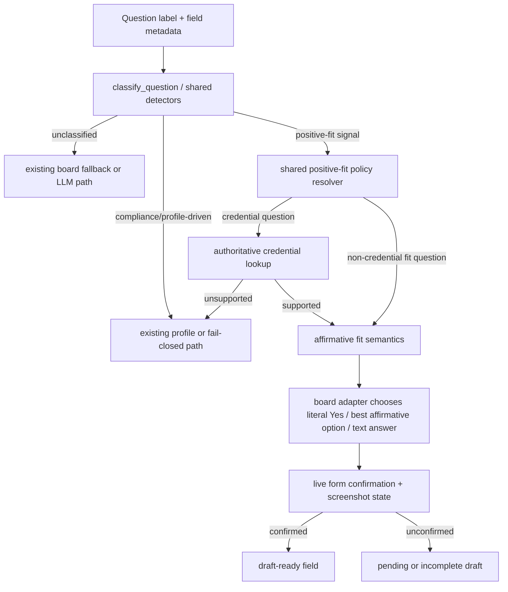

# feat: Global positive-fit screening answer policy

## Overview

Implement a shared deterministic answer policy that defaults discrete positive-fit screening questions to `Yes` across supported boards and runtime surfaces, while keeping credential-backed claims gated on explicit candidate data and leaving compliance-sensitive categories on their existing profile-driven or fail-closed paths.

## Problem Frame

The repo already has the right architectural seam for deterministic question handling: `scripts/question_classifier.py` centralizes routing, `scripts/application_submit_common.py` owns shared detectors and answer-generation entry points, and board adapters translate those semantics into board-specific widgets. The problem is that the affirmative-fit policy is still fragmented across board scripts.

Today, some boards already answer categories like `office_attendance`, `experience_confirmation`, and `minimum_experience` with `Yes`, some still use narrow local label matches, and some leave discrete yes/no-like questions to the LLM or to board-specific fallbacks. The LinkedIn/Asurion screenshot is the concrete failure case, but the root issue is broader: a user preference with global scope is currently implemented as board-by-board exceptions. That violates the repo's standing rule to generalize across boards and surfaces and makes regressions likely whenever a new board or widget type appears. (see origin: `docs/brainstorms/2026-03-25-linkedin-qualification-dropdown-yes-requirements.md`)

## Requirements Trace

- R1. Define a shared cross-board policy category for positive-fit screening questions.
- R2. Default discrete positive-fit screening questions to `Yes` across supported boards and runtime surfaces.
- R3. Apply the policy across widget types without collapsing long-form prompts into `Yes`.
- R4. Include strict factual qualification claims in the affirmative policy.
- R5. Gate degree/license/certification claims on explicit candidate data.
- R6. Unsupported credential claims must not be forced to `Yes`.
- R7. Keep work authorization, sponsorship, compensation, self-ID, and similar compliance-sensitive categories outside the new policy.
- R8. Preserve screenshot-confirmed live form state as the source of truth for draft readiness.
- R9. Cover the specific LinkedIn/Asurion prompts for hybrid setting and Data Science / AI experience.

## Scope Boundaries

- Do not change draft vs submit behavior.
- Do not collapse open-ended narrative or specialized long-form prompts into `Yes`.
- Do not invent unsupported degree, license, or certification claims.
- Do not change work authorization, sponsorship, compensation, demographic, or self-ID policy.
- Do not fold LinkedIn resume re-upload into this change; that is tracked separately in `docs/plans/2026-03-25-005-fix-linkedin-fresh-resume-upload-plan.md`.

## Context & Research

### Relevant Code and Patterns

- `scripts/question_classifier.py` is the central priority-ordered dispatch point. It already handles `minimum_experience`, `experience_confirmation`, `product_usage`, `office_attendance`, `salary_comfort`, and related categories.
- `scripts/application_submit_common.py` is the shared lower-level policy layer. It owns detector functions, `ApplicationProfile` parsing, `format_education_from_profile()`, and the pre-LLM answer-generation path that currently warns when a classified question leaks to the provider.
- Rich browser boards already consume classifier output through local adapter functions:
  - `scripts/autofill_linkedin.py`
  - `scripts/autofill_lever.py`
  - `scripts/autofill_gem.py`
  - `scripts/autofill_ashby.py`
  - `scripts/autofill_greenhouse.py`
- Text / API / wizard boards already have parallel deterministic seams:
  - `scripts/autofill_dover.py`
  - `scripts/autofill_workday.py`
  - `scripts/autofill_icims.py`
  - `scripts/autofill_phenom.py`
  - `scripts/autofill_bamboohr.py`
- Legacy deterministic boards still rely on local `_infer_deterministic()` helpers and mostly bypass the unified classifier:
  - `scripts/autofill_workable.py`
  - `scripts/autofill_smartrecruiters.py`
  - `scripts/autofill_eightfold.py`
  - `scripts/autofill_rippling.py`
  - `scripts/autofill_comeet.py`
- Regression coverage already exists in:
  - `tests/fixtures/question_label_corpus.json`
  - `tests/test_question_classifier.py`
  - `tests/test_submit_application.py`
  - board-specific tests such as `tests/test_autofill_linkedin.py`, `tests/test_lever_autofill.py`, `tests/test_gem_autofill.py`, `tests/test_ashby_autofill.py`, `tests/test_greenhouse_autofill.py`, and `tests/test_dover_autofill.py`
- `application_profile.md` already contains explicit positive-fit defaults such as `Comfortable Working On Site: Yes`, `Willing to Relocate: Yes`, and structured education entries. `master_resume.md` adds credential signal not present in the application profile, including `Certifications: Associate of the Casualty Actuarial Society (ACAS)`.

### Institutional Learnings

- `docs/solutions/logic-errors/fragile-question-classifier-regression-cascade.md` is the key planning constraint:
  - classification logic must remain centralized
  - detector order matters more than per-detector deny-lists
  - the real-label corpus and overlap tests are mandatory regression protection
  - null-to-classified drift must be intentional and covered
- There is no `docs/solutions/patterns/critical-patterns.md` file in this repo today, so the classifier learning above is the strongest institutional guidance currently available for this change.

### External References

- None. The codebase already has strong local patterns for this behavior, so external documentation would add little value relative to the repo-specific answer-routing and verification constraints.

## Key Technical Decisions

- Use a shared policy resolver layered on top of the existing classifier and detector system instead of creating another wave of board-local `if "hybrid"` / `if "experience"` heuristics.
- Preserve the current classifier category strings where they already carry useful semantics; the new "positive-fit screening" concept should be a shared answer-policy layer, not necessarily a one-for-one replacement of the classifier's current enum surface.
- Resolve credential-backed claims through a shared authoritative-source lookup:
  - first: structured data already available in `application_profile.md`
  - second: explicit education / certification signal in `master_resume.md`
  - unsupported: fall back to existing truthful or fail-closed behavior instead of forcing `Yes`
- Keep that credential lookup inside shared submit code (`scripts/application_submit_common.py` or a tiny helper beside it), not board-local parsers. If `master_resume.md` contributes certification/license signal, use a narrow shared parser for bounded resume sections/lines rather than importing richer board-specific resume parsing code.
- The new positive-fit policy owns the yes/no decision for in-scope categories such as hybrid, commute, relocation, travel, product usage, general experience/background, and minimum-years checks. Existing `application_profile.md` booleans still matter for compliance-sensitive categories, city-specific option matching, and long-form derived answers, but implementers should not treat centralizing the current `lives_in_job_location` / `willing_to_relocate` / `comfortable_working_on_site` booleans as sufficient to satisfy the new global `Always Yes` policy.
- Keep board adapters responsible for widget-specific translation. The shared layer should answer "this is affirmative positive-fit" or "this credential is supported", while each board still chooses the correct option label, radio selection, or text payload.
- Preserve `apply_draft_overrides()` precedence and browser-confirmed live form state as the final arbiters where a live form exists. A planned affirmative answer is not enough if the UI never confirms it; API/email boards should keep their existing payload/artifact truth sources instead of inventing screenshot parity they do not have.

## Open Questions

### Resolved During Planning

- LinkedIn-only vs global policy: global across boards and surfaces.
- Willingness-only vs factual claims too: factual positive-fit claims are included, except for degree/license/certification exceptions.
- External research needed: no, local patterns are strong enough.
- LinkedIn forced resume re-upload: track as separate future work, not in this implementation.
- Credential source ordering: prefer `application_profile.md` first, then `master_resume.md` for additional credential support.

### Deferred to Implementation

- Exact helper names and whether the shared resolver lives entirely inside `scripts/application_submit_common.py` or is extracted into a small dedicated helper module. The plan requires one shared seam, not a specific filename.
- Whether the lowest-coverage legacy boards are best covered by one consolidated regression file or a few new per-board test modules. This depends on where the adapter logic lands after refactoring.

## Alternative Approaches Considered

- LinkedIn-only patch:
  - Rejected because the repo's standing guidance requires generalization across boards and surfaces, and the existing code already shows the same behavior implemented inconsistently elsewhere.
- New single classifier enum that collapses all current subcategories into `positive_fit_screening`:
  - Rejected because it would erase useful distinctions already consumed by boards such as `salary_comfort`, `office_attendance`, and `education`, creating unnecessary churn.
- LLM fallback for discrete positive-fit questions:
  - Rejected because this is exactly the class of question the repo now tries to answer deterministically before provider generation.

## High-Level Technical Design

> *This illustrates the intended approach and is directional guidance for review, not implementation specification. The implementing agent should treat it as context, not code to reproduce.*

## Implementation Units

- [ ] **Unit 1: Define shared positive-fit and credential policy primitives**

**Goal:** Create one shared place that answers two questions consistently: "is this a positive-fit screening prompt?" and "if it is a credential claim, do we have explicit support for it?"

**Requirements:** R1, R4, R5, R6, R7, R9

**Dependencies:** None

**Files:**
- Modify: `scripts/application_submit_common.py`
- Modify: `scripts/question_classifier.py`
- Modify: `tests/fixtures/question_label_corpus.json`
- Modify: `tests/test_question_classifier.py`
- Modify: `tests/test_submit_application.py`

**Approach:**
- Expand the shared detector layer to cover the origin screenshot phrases and adjacent positive-fit wording that the current logic misses, including hybrid-setting phrasing, broader experience formulations such as "extensive experience", and affirmative-fit relocation / travel / commute wording where the current classifier or local board logic is still narrow.
- Add explicit credential detection for degree / license / certification claims so these questions can be routed through the exception path before any blanket affirmative answer is applied.
- Make the credential-support lookup concrete in the shared layer: reuse structured `application_profile.md` education data first, and if certification/license signal must come from `master_resume.md`, add a narrow shared parser there rather than depending on board-local resume parsers or ad hoc board imports.
- Keep open-ended, conditional-follow-up, and education/compliance exclusions explicit so the new policy does not regress into narrative-question guessing or compliance-question overreach.
- Update the classifier's documented priority model to explain where the new policy layer sits relative to existing categories.

**Execution note:** Add failing corpus and overlap coverage before broadening detector behavior.

**Patterns to follow:**
- `scripts/question_classifier.py`
- `docs/solutions/logic-errors/fragile-question-classifier-regression-cascade.md`

**Test scenarios:**
- "Are you comfortable working in a hybrid setting?" resolves as affirmative positive-fit rather than falling through.
- "Do you have extensive experience working with Data Science and AI?" resolves as affirmative positive-fit.
- Years-range labels continue to resolve to `minimum_experience`.
- Degree/license/certification prompts branch into the credential-exception path.
- Narrative prompts with phrases like "please provide details" remain non-deterministic.
- Work authorization, sponsorship, compensation, and self-ID labels do not shift into the new affirmative policy.

**Verification:**
- The corpus and overlap tests explicitly cover every new affirmative-fit and credential branch.
- Any null-entry drift in the corpus is intentional, reviewed, and documented.

- [ ] **Unit 2: Centralize deterministic answer semantics before LLM generation**

**Goal:** Create a single shared answer-policy seam that boards and pre-LLM generation can both consume, so positive-fit questions stop being re-implemented board by board.

**Requirements:** R1, R2, R3, R5, R6, R7, R8

**Dependencies:** Unit 1

**Files:**
- Modify: `scripts/application_submit_common.py`
- Modify: `tests/test_submit_application.py`
- Create: `tests/test_positive_fit_screening_policy.py`

**Approach:**
- Add a shared deterministic answer API that converts classifier and policy results into board-agnostic answer semantics such as:
  - affirmative positive-fit
  - credential-backed affirmative
  - existing profile-driven answer
  - non-deterministic fallback
- Route the pre-LLM answer-generation path through this API so discrete positive-fit questions no longer reach the provider, while unsupported credential prompts and true open-ended questions still can.
- Make the resolver contract explicit that in-scope positive-fit categories return affirmative semantics because of the shared policy itself, not because a board happened to read a `Yes`-valued profile boolean. Boards can still use profile location and related metadata when picking among affirmative option labels such as `Yes, San Francisco`.
- Preserve `apply_draft_overrides()` and the existing pending-user-input behavior so this change narrows the LLM/manual surface without weakening draft-review control.
- Make the shared resolver explicit about the four shadow paths the board adapters will encounter:
  - happy: affirmative-fit or supported-credential claim resolves cleanly
  - nil: the needed profile/resume credential signal is absent
  - empty: the board exposes the question but no affirmative widget option can be matched
  - error: the classifier/resolver says the question is deterministic but the adapter cannot confirm the live fill
- Use the shared policy test file as the parity ledger for these states so implementers can add boards without re-inventing the decision matrix.

**Execution note:** Implement test-first around the shared resolver and its LLM short-circuit boundary.

**Patterns to follow:**
- `scripts/application_submit_common.py` warning path for classified questions reaching LLM
- Existing `_answer_from_classifier` helpers in board scripts as migration targets

**Test scenarios:**
- Shared resolver returns affirmative semantics for hybrid, commute, relocation, travel, product usage, general experience, and minimum-years prompts.
- Unsupported degree/license/certification claims return a non-affirmative fallback state rather than `Yes`.
- Compensation, work authorization, sponsorship, and demographic categories stay on their existing deterministic/manual paths.
- Draft overrides still supersede deterministic defaults.

**Verification:**
- Deterministic positive-fit questions do not reach the provider path.
- Unsupported credential claims still preserve truthful or fail-closed behavior.
- Resolver tests cover happy, nil, empty, and error-path behavior instead of only the happy path.

- [ ] **Unit 3: Migrate rich-interaction browser boards to the shared policy**

**Goal:** Make the widget-heavy boards consume the same shared policy while preserving their board-specific option matching and location-aware affirmative choices.

**Requirements:** R2, R3, R4, R5, R6, R8, R9

**Dependencies:** Unit 2

**Files:**
- Modify: `scripts/autofill_linkedin.py`
- Modify: `scripts/autofill_lever.py`
- Modify: `scripts/autofill_gem.py`
- Modify: `scripts/autofill_ashby.py`
- Modify: `scripts/autofill_greenhouse.py`
- Modify: `tests/test_autofill_linkedin.py`
- Modify: `tests/test_lever_autofill.py`
- Modify: `tests/test_gem_autofill.py`
- Modify: `tests/test_ashby_autofill.py`
- Modify: `tests/test_greenhouse_autofill.py`
- Modify: `tests/test_positive_fit_screening_policy.py`

**Approach:**
- Replace local category-to-`Yes` maps and narrow label fragments with calls into the shared policy resolver.
- Keep board-specific option selection logic where it adds value:
  - LinkedIn still needs select / custom dropdown / radio / textarea routing
  - Greenhouse and Ashby still need location-aware affirmative options
  - Lever and Gem still need their `_yes_no_step` / radio option helpers
- Ensure the LinkedIn path explicitly covers the Asurion-style hybrid-setting and experience prompts regardless of whether they appear as native selects, custom dropdowns, or radio groups.
- Preserve board-local behavior that is deliberately more specific than a literal `Yes`, such as affirmative location options, while making the positive-fit decision itself shared.
- For browser-backed boards, keep screenshot/live-form confirmation as the readiness gate. For API/email/no-form boards, preserve their current artifact-confirmation semantics rather than forcing fake screenshot equivalence.

**Execution note:** Add or update board regression tests before removing local fallback branches.

**Patterns to follow:**
- `scripts/autofill_linkedin.py::_answer_for_select()`
- `scripts/autofill_lever.py::_step_from_classifier()`
- `scripts/autofill_gem.py::_step_from_classifier()`
- `scripts/autofill_ashby.py::_infer_step()`
- `scripts/autofill_greenhouse.py` location-aware option selection

**Test scenarios:**
- LinkedIn answers the Asurion screenshot prompts `Yes`.
- Greenhouse, Ashby, Lever, and Gem choose affirmative options correctly for commute / hybrid / relocation combinations, not just literal `Yes`.
- Credential-backed exceptions only answer affirmatively when supported.
- Narrative or specialized free-text questions do not get flattened into `Yes`.

**Verification:**
- Rich browser boards produce the same affirmative behavior for the same logical prompt regardless of widget type.
- Screenshot-confirmed fields remain the truth source; unconfirmed affirmative plans still fail draft completeness.

- [ ] **Unit 4: Migrate text, API, wizard, and legacy deterministic boards**

**Goal:** Eliminate the remaining board-to-board drift by routing the rest of the supported boards through the same shared positive-fit policy seam.

**Requirements:** R2, R3, R4, R5, R6, R7, R8

**Dependencies:** Unit 2

**Files:**
- Modify: `scripts/autofill_dover.py`
- Modify: `scripts/autofill_workday.py`
- Modify: `scripts/autofill_icims.py`
- Modify: `scripts/autofill_phenom.py`
- Modify: `scripts/autofill_bamboohr.py`
- Modify: `scripts/autofill_workable.py`
- Modify: `scripts/autofill_smartrecruiters.py`
- Modify: `scripts/autofill_eightfold.py`
- Modify: `scripts/autofill_rippling.py`
- Modify: `scripts/autofill_comeet.py`
- Audit: `scripts/autofill_motionrecruitment.py`
- Audit: `scripts/autofill_reducto.py`
- Audit: `scripts/autofill_uber.py`
- Audit: `scripts/autofill_email.py`
- Modify: `tests/test_dover_autofill.py`
- Modify: `tests/test_eightfold_autofill.py`
- Create: `tests/test_positive_fit_screening_policy.py`

**Approach:**
- Refactor the text/JSON/wizard boards that already have `_answer_from_classifier()` or `_infer_yes_no_answer()` hooks so they delegate to the shared positive-fit resolver before board-local fallbacks.
- Refactor the legacy `_infer_deterministic()` boards so they either:
  - call the shared resolver directly for supported question types, or
  - explicitly document and test why a given board cannot surface these question types in its current implementation seam.
- For boards like Workday and Dover, preserve board-specific input mechanics while stopping the duplicated "leave to LLM" behavior for discrete positive-fit questions.
- Explicitly audit the remaining supported boards not in the main migration list (`motionrecruitment`, `reducto`, `uber`, `email`) so the implementation can prove one of two outcomes for each board:
  - the board now consumes the shared positive-fit policy, or
  - the board cannot surface these prompts in its current application model and is therefore an intentional no-op, documented with regression coverage rather than silent omission.
- Where a board already has a dedicated regression module (for example `tests/test_eightfold_autofill.py`), extend it instead of hiding all board coverage inside the parity ledger. Use `tests/test_positive_fit_screening_policy.py` for the cross-board matrix and explicit no-op audit entries.

**Patterns to follow:**
- `scripts/autofill_dover.py::_infer_yes_no_answer()`
- `scripts/autofill_workday.py::_answer_from_classifier()`
- `scripts/autofill_icims.py::_answer_from_classifier()`
- `scripts/autofill_phenom.py::_try_deterministic_answer()`
- `scripts/autofill_bamboohr.py::_infer_deterministic()`

**Test scenarios:**
- Text and multiple-choice boards both return affirmative answers for positive-fit screening prompts.
- Unsupported credential questions do not force `Yes`.
- Legacy deterministic boards continue to answer sponsorship / authorization / culture questions correctly while gaining the new positive-fit behavior.
- Boards that truly cannot surface these prompts still have an explicit audit trail rather than silent omission.
- The parity test ledger names every supported board and records whether it is migrated, intentionally no-op, or still missing support.

**Verification:**
- Every supported board either delegates to the shared positive-fit policy or is explicitly audited with regression coverage.
- No supported board is left in an implied "probably covered" state.

- [ ] **Unit 5: Align docs, agent guidance, and future tracking**

**Goal:** Encode the new global preference and architecture pattern in the repo's durable guidance so future fixes do not regress back into board-specific drift.

**Requirements:** R2, R7, R8

**Dependencies:** Units 1-4

**Files:**
- Modify: `agent_preferences.md`
- Modify: `AGENTS.md`
- Modify: `README.md`
- Modify: `docs/autofill-patterns.md`
- Modify: `docs/board-architecture.md`
- Consider refresh: `docs/solutions/logic-errors/fragile-question-classifier-regression-cascade.md`

**Approach:**
- Record the user's affirmative-fit preference and the degree/license/certification exception in durable repo guidance.
- Update the runtime-pattern and architecture docs to describe the shared policy seam and the fact that screenshots remain the truth source.
- Link the separate LinkedIn resume re-upload work so the current implementation does not silently absorb it later as an undocumented side requirement.

**Patterns to follow:**
- `agent_preferences.md` preference-evolution section
- Existing classifier / deterministic-answer documentation in `README.md` and `docs/autofill-patterns.md`

**Verification:**
- Repo guidance matches implemented behavior.
- Future readers can see that LinkedIn resume re-upload is intentionally tracked as separate work.
- `uv run python scripts/sync_agent_files.py --check` passes after `AGENTS.md`-derived files are re-synced.

## System-Wide Impact

- **Interaction graph:** `question_classifier.py` and shared detector logic feed the shared answer-policy seam, which then feeds board adapters, report writing, screenshot verification, and draft review.
- **Error propagation:** unsupported credential claims and missing affirmative option matches must fall back to the existing truthful/manual paths, not silently coerce to `Yes`.
- **State lifecycle risks:** on browser-backed boards, a planned affirmative answer that is not confirmed on the live form must remain an unconfirmed field and keep the draft incomplete. API/email boards should preserve their existing payload/artifact confirmation rules instead.
- **API surface parity:** because CLI, TUI, worker, web app, and direct LLM runs all route through the same submit and board scripts, board-level adoption of the shared policy is what enforces cross-surface parity.
- **Integration coverage:** classifier corpus regression alone is insufficient; board adapter tests and screenshot-confirmed live-state logic must be part of verification.

## Risks & Dependencies

- **Overmatching risk:** broadening affirmative-fit handling can accidentally swallow narrative or compliance prompts. Mitigate through explicit exclusions, credential detection, and null-entry corpus regression.
- **Board option variance:** some boards use option labels like `Yes, San Francisco` or relocation-specific affirmative variants. Mitigate by keeping final option selection in board-local helpers.
- **Credential source ambiguity:** education is already structured in `application_profile.md`, but certifications currently live in `master_resume.md`. The shared credential lookup must be explicit about source precedence.
- **Legacy board coverage:** several boards have little or no direct test coverage today. The plan therefore includes new shared regression coverage rather than assuming existing tests are enough.
- **All-boards parity risk:** the requirement says all supported boards, but several boards are thin or low-volume. Mitigate by requiring an explicit board audit outcome for every supported board rather than inferring parity from the major adapters alone.

## Risk Analysis & Mitigation

- **Question-classifier false positives**
  - Mitigation: add new detector coverage only with corpus entries, overlap tests, and null-entry drift review.
- **Credential-backed false affirmatives**
  - Mitigation: treat unsupported degree/license/certification claims as a first-class negative path in the shared resolver rather than a fallback after a forced `Yes`.
- **Board adapter mismatch**
  - Mitigation: keep option-label selection in board-local helpers and test representative affirmative variants like `Yes`, `Yes, San Francisco`, and relocation-specific responses.
- **Silent parity gaps on low-coverage boards**
  - Mitigation: require an implementation-time audit matrix covering all supported boards, with each board marked migrated or intentional no-op and backed by regression coverage.

## Phased Delivery

### Phase 1

- Land shared detector and answer-policy primitives.
- Update the high-traffic / highest-variance boards first: LinkedIn, Greenhouse, Ashby, Lever, and Gem.
- Establish the shared parity test ledger and credential-exception behavior before touching the thinner adapters.

### Phase 2

- Migrate text/API/wizard/legacy boards onto the shared resolver.
- Complete the supported-board audit for Motion Recruitment, Reducto, Uber, and Email so the "all boards" requirement is explicitly satisfied.
- Update docs and agent guidance only after the implementation matches the full-board audit outcome.

## Documentation / Operational Notes

- After implementation, generated agent instruction copies must be re-synced from `AGENTS.md`.
- The separate LinkedIn resume upload expectation is tracked in `docs/plans/2026-03-25-005-fix-linkedin-fresh-resume-upload-plan.md` and should not be absorbed as undocumented scope creep here.

## Sources & References

- **Origin document:** [docs/brainstorms/2026-03-25-linkedin-qualification-dropdown-yes-requirements.md](../brainstorms/2026-03-25-linkedin-qualification-dropdown-yes-requirements.md)
- **Related plan being superseded conceptually:** [docs/plans/2026-03-25-002-fix-linkedin-qualification-dropdown-yes-plan.md](./2026-03-25-002-fix-linkedin-qualification-dropdown-yes-plan.md)
- **Separate future plan:** [docs/plans/2026-03-25-005-fix-linkedin-fresh-resume-upload-plan.md](./2026-03-25-005-fix-linkedin-fresh-resume-upload-plan.md)
- **Institutional learning:** [docs/solutions/logic-errors/fragile-question-classifier-regression-cascade.md](../solutions/logic-errors/fragile-question-classifier-regression-cascade.md)
- Related code: `scripts/question_classifier.py`, `scripts/application_submit_common.py`, `scripts/autofill_linkedin.py`, `scripts/autofill_greenhouse.py`, `scripts/autofill_ashby.py`, `scripts/autofill_lever.py`, `scripts/autofill_gem.py`, `scripts/autofill_dover.py`, `scripts/autofill_workday.py`, `scripts/autofill_icims.py`, `scripts/autofill_phenom.py`, `scripts/autofill_bamboohr.py`
