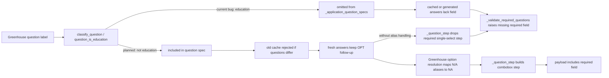

# fix: Preserve Greenhouse OPT follow-up fields on submit reruns

## Overview

The Duolingo Greenhouse job stopped on March 26, 2026 after draft approval because submit payload construction dropped a required OPT-extension follow-up field before validation. The fix should stop OPT / STEM immigration follow-up prompts from being misread as education questions, keep them in the Greenhouse question spec, and ensure stale cached answer files are rejected automatically on rerun so CLI, TUI, worker, web, and direct runs all recover without manual cleanup.

## Problem Frame

This is not a retry-policy or UI problem. Job `298` (`Duolingo`, `senior-pm-in-app-purchases`, `greenhouse`, source `linkedin`) stopped at `2026-03-26 06:08:30` with:

- `Failed after 2 retries: All submission attempts failed (last exit 1).`
- `ValueError: Autofill payload is missing required Greenhouse fields: question_35137925002`

Local artifacts show the upstream cause:

- `output/duolingo/senior-pm-in-app-purchases/submit/application_answers.json` from `2026-03-25T22:04:15+00:00` includes `question_35137924002` but omits `question_35137925002`.
- `tests/fixtures/question_label_corpus.json` currently marks the exact OPT-extension label as `education`, so Greenhouse treats it as deterministic and excludes it from `_application_question_specs()`.
- Once that field disappears from the question spec, both fresh generated answers and reused cached answers omit it, so `_validate_required_questions()` stops submit after approval.
- The saved `greenhouse_application_page.html` shows both OPT follow-ups as required `Yes` / `No` / `NA` single-select fields, so a second Greenhouse-only risk remains after classifier repair: conditional answers that normalize to `N/A` must still resolve to the live `NA` option label during step construction.

Because all entrypoints share the same Greenhouse submitter and cached-answer contract, a shared classifier mistake propagates through every surface until the question spec changes and old caches are invalidated.

## Requirements Trace

- R1. The Duolingo OPT-extension follow-up (`question_35137925002`) must no longer disappear from Greenhouse question specs or submit payloads.
- R2. OPT / Optional Practical Training / STEM-style immigration follow-up prompts must not be classified as `education` merely because they mention `degree`, `institution`, or similar education keywords.
- R3. Real education prompts and credential-claim prompts must keep their current routing.
- R4. Existing cached `submit/application_answers.json` files that predate the fix must self-invalidate on rerun when the question spec changes; no manual artifact deletion should be required.
- R5. The fix must cover the shared paths used by CLI, TUI, worker, web, and direct LLM runs.

## Scope Boundaries

- No retry/backoff changes to the stopped-job pipeline.
- No new immigration-profile schema in `application_profile.md`.
- No broad rewrite of all work-authorization handling across every board.
- No UI changes to the stopped-job banner, tabs, or retry controls.

## Context & Research

### Relevant Code and Patterns

- `scripts/application_submit_common.py`
  - `question_is_education()`
  - `load_cached_application_answers()`
  - `find_matching_cached_application_answers_path()`
- `scripts/output_layout.py`
  - `existing_submit_dirs()`
  - active/default/prior `submit*` ordering used during cache reuse
- `scripts/question_classifier.py`
  - priority-ordered shared classification used by board submitters
- `scripts/autofill_greenhouse.py`
  - `_fetch_greenhouse_html()`
  - `_question_is_deterministic()`
  - `_question_requires_generated_answer()`
  - `_application_question_specs()`
  - `_generate_application_answers()`
  - `_question_step()`
  - `_normalized_option_match_candidates()`
  - `_match_option_label()`
  - `_validate_required_questions()`
- `scripts/job_assets_pipeline.py`
  - direct single-job submit path invokes `submit_application.py`
- `scripts/pipeline_orchestrator.py`
  - worker submit phase invokes the same submit step used by stopped-job recovery
- `tests/test_question_classifier.py`
  - corpus regression and null-entry drift protection
- `tests/fixtures/question_label_corpus.json`
  - currently labels the exact OPT-extension prompt as `education`
- `tests/test_submit_application.py`
  - direct `question_is_education()` unit coverage
  - shared cached-answer reuse contract
- `tests/test_greenhouse_autofill.py`
  - existing required-question validation tests
  - existing Greenhouse cache-reuse tests
- `tests/test_output_layout.py`
  - active/default/prior submit-dir precedence for cache lookup
- `output/duolingo/senior-pm-in-app-purchases/submit/application_answers.json`
  - reproduced stale answer set missing `question_35137925002`
- `output/duolingo/senior-pm-in-app-purchases/submit/greenhouse_application_page.html`
  - confirms both OPT follow-ups are required and both offer `Yes` / `No` / `NA`
  - remains a possible fallback input on rerun if Greenhouse HTML download fails

### Institutional Learnings

- `docs/solutions/logic-errors/fragile-question-classifier-regression-cascade.md`
  - specific-before-broad routing prevents keyword overlap regressions
  - real production labels should anchor regression coverage
  - null-entry corpus tests are the guardrail against accidental new classifications
- `docs/autofill-patterns.md`
  - required conditional follow-ups should resolve to `N/A` rather than fail validation when the parent condition does not apply
  - work authorization and sponsorship stay on truthful paths
- `docs/solutions/patterns/critical-patterns.md`
  - not present in this repo; no additional critical-pattern file was available to consult

### External References

- None. The failing artifact, shared classifier, and Greenhouse submit path already provide enough evidence.

## Key Technical Decisions

- Fix the shared education detector rather than patching retries or the stopped-job UI.
  Rationale: the failure originates before Greenhouse payload validation. Retry logic only repeats the same bad question spec.

- Treat OPT / Optional Practical Training / STEM immigration follow-ups as non-education for now, and keep them in the generated-answer path instead of introducing a new deterministic category immediately.
  Rationale: the current profile schema does not encode enough structured immigration detail to answer every OPT follow-up deterministically and truthfully. The safe immediate fix is to stop the false `education` match so Greenhouse includes the field and the existing conditional-answer behavior can run.

- Resolve `N/A` versus `NA` at the Greenhouse option-resolution seam (`_normalized_option_match_candidates()` / `_match_option_label()` or an equivalent single Greenhouse-local alias helper), not through question-spec routing or shared generated-answer validation.
  Rationale: the classifier mistake is shared, but the label-alias problem only appears when Greenhouse maps generated single-select answers onto live option labels during `_question_step()`. Keeping the alias rule local fixes the real Duolingo failure shape without widening shared cache/validation behavior for other boards.

- Use shared classifier regression plus Greenhouse integration regression as the contract.
  Rationale: the bug is shared in origin but Greenhouse is where it surfaced as a real stopped job. Both layers need tests.

- Rely on exact question-spec cache matching to recover old artifacts, not a migration script.
  Rationale: `load_cached_application_answers()` already rejects cached files when `questions` no longer matches the current spec, which is the behavior needed here.

- Keep the implementation bounded unless another board reproduces the same failure shape.
  Rationale: this repo explicitly prefers generalization at shared seams, but not speculative cross-board rewrites without evidence.

## Open Questions

### Resolved During Planning

- Should this update the March 26 current-state residency plan? No. That plan addresses role-location leakage for residency prompts, not generated-answer omission for OPT follow-ups.
- Should this be folded into the March 25 pipeline-resilience plan? No. The stop surfaced through retries, but the root cause is a classifier / payload bug, not retry policy.
- Does the stale Duolingo answer cache need a one-off cleanup script? No. The existing exact-question-spec cache contract should invalidate it once the spec includes `question_35137925002`.
- Is external research needed? No.

### Deferred to Implementation

- Whether any other board has a production label with the same OPT-extension wording that should receive parallel regression coverage after the shared classifier change lands.
- Whether a future structured immigration-profile schema should promote OPT / STEM follow-ups onto a deterministic work-authorization helper instead of the generated-answer path.

## Alternative Approaches Considered

- Promote OPT / STEM follow-ups into a new shared `work_authorization` subcategory immediately.
  Not chosen for this pass because `application_profile.md` does not yet encode enough structured immigration state to answer every OPT follow-up truthfully without falling back to broad assumptions.

- Add a Duolingo- or field-id-specific Greenhouse patch for `question_35137925002`.
  Rejected because the failure is caused by shared classifier semantics and stale cache reuse, and the same label shape could recur on other Greenhouse jobs.

- Add a one-off artifact cleanup or cache purge step to the retry flow.
  Rejected because the current exact-question-spec cache contract already provides the right invalidation mechanism once the question spec is corrected.

## High-Level Technical Design

> *This illustrates the intended approach and is directional guidance for review, not implementation specification. The implementing agent should treat it as context, not code to reproduce.*

## Implementation Units

- [x] **Unit 1: Remove OPT immigration follow-ups from the education classifier**

**Goal:** Stop shared classification from swallowing immigration follow-up prompts as `education`.

**Requirements:** R1, R2, R3, R5

**Dependencies:** None

**Files:**
- Modify: `scripts/application_submit_common.py`
- Modify: `tests/fixtures/question_label_corpus.json`
- Modify: `tests/test_submit_application.py`
- Modify: `tests/test_question_classifier.py`
- Test: `tests/test_submit_application.py`
- Test: `tests/test_question_classifier.py`

**Approach:**
- Narrow `question_is_education()` so OPT / Optional Practical Training / STEM / immigration follow-up phrasing is excluded from education matching even when the label contains `degree` or `institution`.
- Update the exact Duolingo corpus entry from `education` to unclassified (`null`) and keep paired regression coverage with the first OPT follow-up label that is already unclassified in the corpus.
- Add direct detector coverage in `tests/test_submit_application.py` plus classifier corpus coverage in `tests/test_question_classifier.py`, so both the shared helper and the classifier ordering are locked down.
- Keep direct education prompts and credential-claim prompts on their current paths; the exclusion must be specific to immigration-follow-up semantics, not a broad rollback of `degree` detection.

**Execution note:** Start with failing direct-detector and corpus regressions for the two OPT labels before changing the detector.

**Patterns to follow:**
- `docs/solutions/logic-errors/fragile-question-classifier-regression-cascade.md`
- existing direct `question_is_education()` tests in `tests/test_submit_application.py`
- existing null-entry regression in `tests/test_question_classifier.py`

**Test scenarios:**
- `question_is_education()` returns `False` for `After the OPT, are you eligible for a 24-month OPT extension...`.
- `After the OPT, are you eligible for a 24-month OPT extension...` no longer classifies as `education`.
- `If so, are you eligible or currently in a period of Optional Practical Training (OPT)?` remains unclassified.
- `PROVIDE ALL POST-SECONDARY EDUCATION ATTAINED` still classifies as `education`.
- `Do you have a Bachelor's degree?` still classifies as `credential_claim`.

**Verification:**
- Shared detector and shared classifier both stop returning `education` for the Duolingo OPT-extension label.
- The paired OPT follow-up labels remain non-education in both direct and corpus-backed coverage.
- Corpus null-entry regression protects the label from silently drifting back into a deterministic category.
- Existing education and credential-claim coverage stays intact.

- [x] **Unit 2: Lock Greenhouse question-spec and payload coverage for both OPT follow-ups**

**Goal:** Ensure Greenhouse submit planning includes both required OPT follow-ups so payload validation cannot fail after draft approval.

**Requirements:** R1, R3, R5

**Dependencies:** Unit 1

**Files:**
- Modify: `tests/test_greenhouse_autofill.py`
- Modify: `scripts/autofill_greenhouse.py`
- Test: `tests/test_greenhouse_autofill.py`

**Approach:**
- Add an exact-label Greenhouse regression using the two Duolingo OPT follow-ups and `Yes` / `No` / `NA` option sets from the saved HTML.
- Assert `_application_question_specs()` includes both `question_35137924002` and `question_35137925002`.
- Add a payload-oriented regression that proves the required-field path only fails when a step is truly absent, not because classification removed the question upstream.
- Make the expected single-select follow-up semantics explicit: when the parent sponsorship / OPT condition is inapplicable, the Greenhouse path must still land on the real `NA` option even if the shared conditional-follow-up validator or provider output uses `N/A`.
- Commit the alias handling to the Greenhouse option-resolution seam (`_normalized_option_match_candidates()` / `_match_option_label()` or equivalent single Greenhouse-local matching), and do not widen this fix into shared generated-answer validation, retry logic, or UI behavior.

**Patterns to follow:**
- existing required-question validation tests in `tests/test_greenhouse_autofill.py`
- existing generated-answer cache and fallback tests in `tests/test_greenhouse_autofill.py`

**Test scenarios:**
- Both Duolingo OPT follow-up labels appear in `_application_question_specs()`.
- A generated-answer set containing both `NA` values yields steps for both required comboboxes.
- A required conditional single-select answer of `N/A` still resolves to the real Greenhouse `NA` option instead of dropping the step.
- Missing-key, `None`, and blank-string required conditional answers all normalize through the same `N/A` -> `NA` path instead of silently dropping the step.
- Greenhouse still excludes security-code and classic demographic fields from required-question validation.

**Verification:**
- Local reproduction of the Duolingo question set no longer produces `missing required Greenhouse fields: question_35137925002`.
- Greenhouse submit planning preserves both OPT follow-ups through question-spec creation and step building, and the second follow-up produces an option-compatible `NA` step rather than disappearing at match time.
- The fix remains Greenhouse-local at the option-resolution seam; no shared answer-validation contract changes are required for other boards.

- [x] **Unit 3: Prove stale cached answer files self-heal on rerun**

**Goal:** Make retries and restarts recover automatically from old `application_answers.json` files that predate the fixed question spec.

**Requirements:** R1, R4, R5

**Dependencies:** Unit 1, Unit 2

**Files:**
- Modify: `tests/test_submit_application.py`
- Modify: `tests/test_greenhouse_autofill.py`
- Test: `tests/test_submit_application.py`
- Test: `tests/test_greenhouse_autofill.py`

**Approach:**
- Add a stale-cache regression where the cached `questions` list omits `question_35137925002` while the current spec includes it.
- Assert `load_cached_application_answers()` rejects the stale cache, `find_matching_cached_application_answers_path()` skips outdated attempts, and active/default/prior `submit*` directories follow the existing cache-search order.
- Preserve the existing exact-match cache reuse behavior for unchanged specs; the fix should only invalidate stale answers, not disable caching.

**Execution note:** Run after Unit 2 so stale-cache regressions exercise the corrected Greenhouse question spec and step-building path.

**Patterns to follow:**
- cache reuse tests in `tests/test_submit_application.py`
- Greenhouse prior-submit cache reuse test in `tests/test_greenhouse_autofill.py`
- active/default/prior submit-dir ordering in `tests/test_output_layout.py`

**Test scenarios:**
- Active `submit/application_answers.json` missing `question_35137925002` is ignored once the new spec expects it.
- Prior `submit-*` directories missing the field are ignored as cache sources.
- Exact-match prior-attempt caches are still copied into the active submit attempt when the question list is unchanged.
- Exact-match caches are still reused when the question list is unchanged.

**Verification:**
- Submit reruns regenerate a fresh `application_answers.json` containing the missing field instead of reusing stale cached answers, while exact-match caches still copy forward into the active attempt.
- Retry / restart flows recover without manual artifact deletion.

## System-Wide Impact

- **Shared classifier boundary:** `question_is_education()` feeds `scripts/question_classifier.py`, which multiple boards consume. Unit 1 therefore changes a shared submit/classifier seam whose blast radius reaches CLI, TUI, worker, web, and direct runs.
- **Greenhouse-only alias boundary:** the `N/A` versus `NA` fix intentionally stays inside Greenhouse option resolution during `_question_step()`. Other boards should inherit the classifier correction but not the Greenhouse-local option-label aliasing rule.
- **Runtime path verification:** direct single-job runs reach `submit_application.py` through `scripts/job_assets_pipeline.py`, and workers reach the same submit step through `scripts/pipeline_orchestrator.py`. TUI and web should need no dedicated code changes because they consume the same draft/stopped artifacts and statuses.
- **State lifecycle risks:** stale `submit/application_answers.json` and older `submit-*` answer caches can preserve the pre-fix question list. Exact question-spec identity across active/default/prior submit dirs must remain the recovery mechanism.
- **Third-party form dependency:** `_build_payload()` depends on `greenhouse_application_page.html`, and `_fetch_greenhouse_html()` can fall back to older cached HTML. Verification must distinguish fresh Greenhouse form state from fallback snapshots before judging the fix.
- **Integration coverage:** unit tests are necessary but not sufficient. During execution, the Duolingo output directory should be regenerated so `submit/application_answers.json`, `submit/greenhouse_autofill_payload.json`, and the pre-submit screenshot agree on the restored field.

## Risks & Dependencies

- Over-broad education exclusions could demote real degree questions into the generated-answer path.
  Mitigation: use OPT / immigration-specific exclusions only, and keep direct education / credential control tests in the same change.

- Required conditional follow-up answers can arrive as a missing key, `None`, blank string, or `N/A` while the live Greenhouse option label is `NA`.
  Mitigation: anchor regression tests on the real `NA` option set, cover each conditional-answer branch explicitly, and keep alias handling at the Greenhouse option-resolution seam.

- Cache self-healing depends on the question spec changing exactly across active/default/prior submit dirs.
  Mitigation: keep stale-cache tests focused on `load_cached_application_answers()` plus prior-attempt lookup, and preserve exact-match copy-forward behavior for unchanged specs.

- Another board may rely on the current corpus expectation for the same label shape.
  Mitigation: keep the shared fix narrow and perform a bounded audit during implementation rather than broadening scope now.

- Fallback Greenhouse HTML can make a fixed implementation look broken, or preserve a broken implementation across reruns.
  Mitigation: verify with regenerated Duolingo artifacts dated after the implementation, record whether `greenhouse_application_page.html` came from a live fetch or fallback cache, and compare timestamps before treating retry output as authoritative.

## Documentation / Operational Notes

- If implementation adds a stable reusable rule for OPT / STEM follow-ups, update `docs/autofill-patterns.md` so the repo docs reflect that those prompts are not education questions.
- When validating reruns, record whether `submit/greenhouse_application_page.html` came from a live download or a fallback cache before treating the resulting payload as source-of-truth evidence.
- No AGENTS sync is required unless the final implementation establishes a broader new standing rule beyond the current conditional-follow-up guidance.
- Execution should validate the real Duolingo role output because screenshots are the source of truth for autofill results in this repo.

## Sources & References

- User request context: attached web UI screenshot showing Duolingo Greenhouse job stopped after 2 retries
- Related artifact: `output/duolingo/senior-pm-in-app-purchases/submit/application_answers.json`
- Related artifact: `output/duolingo/senior-pm-in-app-purchases/submit/greenhouse_application_page.html`
- Related code: `scripts/application_submit_common.py`
- Related code: `scripts/output_layout.py`
- Related code: `scripts/question_classifier.py`
- Related code: `scripts/autofill_greenhouse.py`
- Related code: `scripts/job_assets_pipeline.py`
- Related code: `scripts/pipeline_orchestrator.py`
- Related tests: `tests/test_question_classifier.py`
- Related tests: `tests/test_greenhouse_autofill.py`
- Related tests: `tests/test_submit_application.py`
- Related tests: `tests/test_output_layout.py`
- Institutional learning: `docs/solutions/logic-errors/fragile-question-classifier-regression-cascade.md`
- Repo rule: `docs/operational-rules.md`
- Adjacent but distinct plan: `docs/plans/2026-03-26-001-fix-greenhouse-current-state-residency-plan.md`
- Adjacent but distinct plan: `docs/plans/2026-03-25-003-feat-pipeline-resilience-reduce-stopped-jobs-plan.md`
