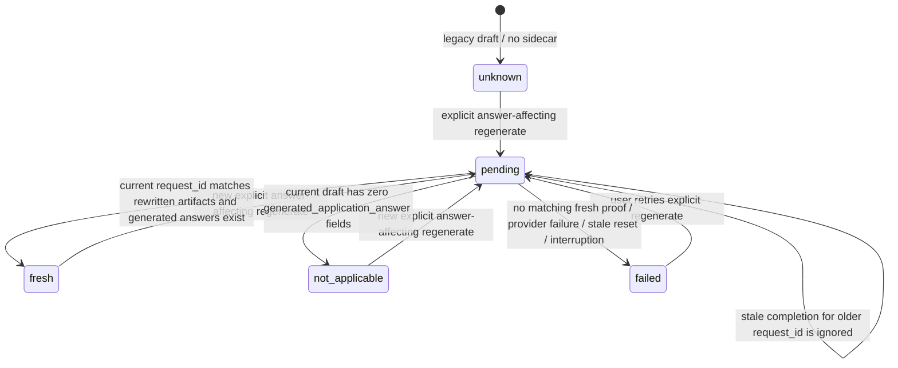

# fix: Enforce fresh answer regeneration proof

## Overview

Explicit answer-affecting regeneration currently behaves like a cache hint instead of a contract. This plan makes every answer-affecting regenerate path write a durable pending refresh request, force a fresh answer-generation run, persist proof of the outcome, and surface that proof in both the web draft UI and draft artifacts. If fresh proof does not materialize, the product must show a visible failure or "nothing to regenerate" state instead of silently returning to `draft` with stale answer artifacts.

## Problem Frame

The product exposes multiple actions that imply application answers will be regenerated, including answer-only reanswer, full regenerate, restart-pipeline, and draft-override flows. In practice, the shared and Greenhouse answer generators can still short-circuit on matching `submit/application_answers.json` payloads or copy matching caches forward from older `submit*` directories. That breaks user trust after prompt or policy changes because a regenerate action can appear to succeed while still showing older answer artifacts and older provider output. The origin requirements document defines this as a global product contract, not a best-effort optimization (see origin: `docs/brainstorms/2026-03-26-answer-regeneration-proof-requirements.md`).

This plan keeps ordinary retry cache reuse intact, but treats explicit answer-affecting regeneration as a separate lifecycle with durable proof. The same contract must hold across web, CLI, TUI, worker, and direct draft-review flows, and it must cover both `scripts/application_submit_common.py` and Greenhouse's parallel `_generate_application_answers()` path.

## Requirements Trace

- R1. Define one shared contract for all answer-affecting regeneration paths.
- R2. Bypass reusable generated-answer caches for explicit regenerate runs, including active and prior `submit*` caches.
- R3. Require a fresh answer-generation execution for generated answer fields.
- R4. Make full draft regeneration invalidate generated-answer caches even when question specs are unchanged.
- R5. Rewrite structured and raw answer artifacts with fresh metadata for successful explicit regenerate runs.
- R6. Expose visible freshness proof in the draft UI, including answer provider and time.
- R7. Do not present stale-artifact fallthrough as a successful regenerated draft.
- R8. Say explicitly when there are no generated answer fields to regenerate.
- R9. Back UI proof with durable state instead of transient assumptions.
- R10. Apply the same contract across boards and runtime surfaces, including Greenhouse.

## Scope Boundaries

- Do not disable cache reuse for ordinary retries where the user did not explicitly request fresh answers.
- Do not require regenerated answer text to differ from the prior version.
- Do not rewrite legacy answer artifacts in place without a new regenerate action.
- Do not change the screenshot-first source-of-truth rule for autofill verification.
- Do not expand this work into resume or cover-letter behavior beyond full-regenerate answer invalidation.

## Context & Research

### Relevant Code and Patterns

- `scripts/application_submit_common.py`
  - `generate_application_answers()` reuses the active `application_answers.json` and can copy forward a matching cache from older `submit*` directories.
  - Structured answer artifacts already carry `generated_at_utc` and `provider`, which can participate in freshness proof.
- `scripts/autofill_greenhouse.py`
  - `_generate_application_answers()` duplicates the same cache-reuse pattern, so Greenhouse needs parity with the shared path.
- `scripts/output_layout.py`
  - `existing_submit_dirs()` makes prior submit attempts eligible for cache reuse.
  - `SUBMIT_FILE_PATTERNS` currently omits `application_answers_fallback_raw.txt`, so current cleanup coverage is incomplete.
- `scripts/pipeline_orchestrator.py`
  - `regenerate_job()` only invalidates `.asset_pipeline_state.json`.
  - `_clear_cached_answers()` only deletes the active `application_answers.json` and `application_answers_raw.txt`.
  - `process_job()` already branches on `reanswering`, which is the right lifecycle seam for explicit answer refresh.
- `scripts/job_web.py`, `scripts/job_tui.py`, `scripts/draft_web.py`, `bin/job-assets`
  - These are the entrypoints that currently imply full or answer-only regeneration across surfaces.
- `scripts/draft_manager.py`, `scripts/build_draft_summary.py`, `scripts/static/app.js`
  - Current draft surfaces do not show durable answer freshness proof, and the web header's `job.provider` reflects asset generation rather than answer generation.
- `scripts/job_db.py`, `scripts/job_worker.py`
  - Startup/stale reset paths can move `reanswering` jobs back to `draft`, so interruption handling must preserve visible non-success semantics.
- Existing output-root sidecars such as `draft_status.json`, `draft_overrides.json`, and `.pipeline_meta.json`
  - The repo already uses root-level durable JSON state for cross-surface coordination, which is the strongest fit for answer refresh proof.

### Institutional Learnings

- `docs/solutions/integration-issues/strict-submit-answer-schema-requires-nullable-optionals.md`
  - Cached answer artifacts can hide the real provider path unless regenerate flows explicitly clear or bypass them.
  - Raw answer artifacts already include provider headers, which strengthens proof and debugging for fresh runs.
- `docs/solutions/integration-issues/adding-new-llm-provider.md`
  - Requeue and restart behavior must be fixed at every shared entrypoint, or stale state persists even after the visible action says "restart" or "regenerate".
- `docs/plans/2026-03-26-002-fix-greenhouse-opt-followup-plan.md`
  - This plan already treats stale `application_answers.json` reuse across active and prior submit directories as a cross-surface contract problem rather than a one-off board bug.
- `docs/solutions/patterns/critical-patterns.md`
  - Not present in this repo. No additional critical-pattern document was available.

### External References

- None. Local code and production artifacts provide enough evidence for planning.

## Key Technical Decisions

- Use a new output-root sidecar, `answer_refresh_status.json`, as the durable source of truth for explicit answer refresh requests and outcomes.
  Rationale: board submitters and direct draft flows operate on `out_dir`, not always on a live DB connection. A root-sidecar works equally well for web, CLI, TUI, worker, and artifact-rendering surfaces.

- Introduce a shared helper module, `scripts/answer_refresh_state.py`, to own the refresh lifecycle.
  Rationale: request marking, cache-bypass checks, success/failure finalization, and proof serialization should live in one place so the shared and Greenhouse paths cannot drift.

- Model explicit answer refresh as a lifecycle, not a boolean flag.
  Rationale: the system needs to distinguish `pending`, `fresh`, `not_applicable`, `failed`, and legacy `unknown` states. That is the cleanest way to tell "fresh run with identical text" apart from "no fresh run happened."

- Each explicit refresh request must carry a unique request id, and the contract must be latest-request-wins.
  Rationale: `generated_at_utc` alone is not a safe correlation key for repeated regenerate clicks or stale worker completions. The system needs a stable way to prove that the visible artifacts belong to the current request, not the previous one.

- Enforce forced refresh at the answer-generation seam, not only in UI endpoints.
  Rationale: bypassing active and prior submit caches must happen inside `generate_application_answers()` and Greenhouse's `_generate_application_answers()` so every runtime surface inherits the same contract.

- Finalize answer freshness proof from persisted answer artifacts plus current autofill-report evidence, not from `jobs.provider`.
  Rationale: `jobs.provider` is asset-generation metadata and can diverge from the provider that actually generated application answers.

- Finalization must be idempotent and artifact-derived, and stale completions must be ignored.
  Rationale: the sidecar, structured cache, and raw artifacts are separate writes. Re-running finalization on normal completion or stale-reset recovery should converge to the same state instead of creating split-brain proof.

- Treat missing proof after an explicit answer refresh request as a visible failure for drafts that should have generated answers.
  Rationale: returning to plain `draft` would preserve the same trust failure that triggered the requirement. The most compatible cross-surface behavior is to write a failed refresh state and stop the job with a specific failure type and message when generated-answer proof was expected but never materialized.

- Treat drafts with zero generated answer fields as `not_applicable`, not failed.
  Rationale: the user still needs a visible explanation, but no provider run is required when there was nothing to regenerate.

- Treat pre-existing drafts with no refresh-sidecar as legacy `unknown`, not fresh.
  Rationale: the scope explicitly excludes rewriting old artifacts without a new regenerate action, so legacy drafts must not be mislabeled as verified fresh.

## Open Questions

### Resolved During Planning

- What should the UI trust as authoritative proof?
  Use `answer_refresh_status.json`, populated from current answer artifacts and current autofill-report facts, with artifact metadata such as answer provider and `generated_at_utc` copied into the sidecar.

- Where should cache invalidation be enforced?
  At both answer-generation seams (`scripts/application_submit_common.py` and `scripts/autofill_greenhouse.py`) plus shared regenerate entrypoints that create the pending refresh request.

- How should the system distinguish identical fresh text from stale reuse?
  Compare a pending refresh request against newly written structured/raw artifacts and finalize explicit `fresh` or `failed` state. Do not use text diff as the success criterion.

- What is the no-generated-answers UX?
  Finalize `not_applicable` in durable state and surface that explanation in the web draft UI and draft summary instead of claiming a fresh answer run.

- How should crash or stale-reset cases behave?
  If a job carrying a pending answer refresh request is reset out of `reanswering` or submit-phase work before proof exists, finalize the refresh state as `failed` with a reset/interruption reason.

### Deferred to Implementation

- Exact helper/function names inside `scripts/answer_refresh_state.py` and the final JSON field names beyond the lifecycle/state requirements.
- Whether the failure banner in the web UI should reuse the existing error banner or introduce a dedicated answer-refresh callout, as long as the failure remains unmistakable.
- Whether CLI/TUI should print answer-refresh proof inline in existing status panels in addition to the shared draft-summary artifact, as long as the durable proof is accessible from those surfaces.

## High-Level Technical Design

> *This illustrates the intended approach and is directional guidance for review, not implementation specification. The implementing agent should treat it as context, not code to reproduce.*

## Implementation Units

- [ ] **Unit 1: Add shared answer-refresh state and artifact helpers**

**Goal:** Create one durable, output-root state model that every surface and answer-generation path can read and write.

**Requirements:** R1, R5, R6, R8, R9, R10

**Dependencies:** None

**Files:**
- Create: `scripts/answer_refresh_state.py`
- Modify: `scripts/output_layout.py`
- Modify: `tests/test_output_layout.py`
- Create: `tests/test_answer_refresh_state.py`
- Test: `tests/test_answer_refresh_state.py`
- Test: `tests/test_output_layout.py`

**Approach:**
- Define the `answer_refresh_status.json` schema at the output-root level, including request metadata, lifecycle status, proof metadata, and a human-readable reason/message.
- Include enough persisted fields to drive all surfaces from the same record: request kind, unique request id, request timestamp, final status, resolved timestamp, answer provider, answer generated-at timestamp, generated-answer count, and failure/not-applicable reason.
- Provide helpers for reading legacy/missing state, marking a pending request, superseding older requests, resolving the active submit-dir answer artifacts, and finalizing `fresh`, `not_applicable`, or `failed`.
- Make finalization request-aware and idempotent: if the helper is asked to finalize an older request after a newer request is already pending or complete, it should leave the newer state untouched.
- Extend output-layout helpers where needed so answer cleanup covers `application_answers_fallback_raw.txt` alongside the existing structured and raw answer artifacts.
- Treat a missing sidecar as legacy `unknown` rather than implying success.

**Patterns to follow:**
- Existing root sidecars: `draft_status.json`, `draft_overrides.json`, `.pipeline_meta.json`
- Submit-dir resolution patterns in `scripts/output_layout.py`

**Test scenarios:**
- Missing sidecar returns legacy `unknown` rather than `fresh`.
- Marking a pending request writes durable request metadata in the output root.
- A newer pending request supersedes prior fresh or pending proof without deleting the current request id.
- Finalizing `fresh` stores answer provider, timestamp, and generated-answer count.
- Finalizing an older request id after a newer request exists leaves the newer request untouched.
- Finalizing `not_applicable` stores an explicit no-generated-answers reason.
- Artifact resolution includes `application_answers_fallback_raw.txt` in forced-refresh cleanup coverage.

**Verification:**
- Every runtime surface can read the same refresh state from disk without a DB lookup.
- Legacy drafts remain visibly non-verified until a new explicit regenerate action occurs.

- [ ] **Unit 2: Force fresh answer generation in shared and Greenhouse paths**

**Goal:** Ensure an explicit answer refresh request bypasses active and prior answer caches and rewrites the answer artifacts for that run.

**Requirements:** R2, R3, R4, R5, R10

**Dependencies:** Unit 1

**Files:**
- Modify: `scripts/application_submit_common.py`
- Modify: `scripts/autofill_greenhouse.py`
- Modify: `scripts/pipeline_orchestrator.py`
- Modify: `tests/test_submit_application.py`
- Modify: `tests/test_greenhouse_autofill.py`
- Modify: `tests/test_pipeline_orchestrator.py`
- Test: `tests/test_submit_application.py`
- Test: `tests/test_greenhouse_autofill.py`
- Test: `tests/test_pipeline_orchestrator.py`

**Approach:**
- Have both answer-generation seams consult the shared refresh-state helper before reading or copying any cached answer artifacts.
- When the refresh state is `pending`, skip reuse of the active `application_answers.json` and skip `existing_submit_dirs()` copy-forward reuse from prior `submit*` directories.
- When the refresh state is `pending`, stamp the current request id into the rewritten structured answer cache and prepend it to raw/fallback raw artifacts alongside provider metadata so finalization can prove request-to-artifact correlation.
- Clear the active structured/raw/fallback raw answer artifacts before the provider run so rewritten files provide unmistakable proof even when the generated prose is textually identical.
- Leave ordinary retries untouched when no explicit refresh request is pending.
- Keep the shared and Greenhouse paths behaviorally identical so the product contract does not depend on board implementation details.

**Execution note:** Start with failing cache-bypass regressions in the shared and Greenhouse test suites before changing production logic.

**Patterns to follow:**
- Existing cache-reuse tests in `tests/test_submit_application.py`
- Existing Greenhouse cache-reuse tests in `tests/test_greenhouse_autofill.py`
- Prevention guidance in `docs/solutions/integration-issues/strict-submit-answer-schema-requires-nullable-optionals.md`

**Test scenarios:**
- A matching active `application_answers.json` is reused when there is no pending refresh request.
- A pending refresh request forces a provider run even when the active cache matches the current question spec.
- A pending refresh request ignores a matching cache in an older `submit-*` directory.
- Rewritten structured/raw artifacts carry the current request id for an explicit refresh run.
- Artifacts written for an older request id do not satisfy a newer pending request.
- Greenhouse's `_generate_application_answers()` follows the same forced-refresh behavior as the shared path.
- Forced refresh cleanup removes `application_answers_fallback_raw.txt` as well as the primary raw/structured files.

**Verification:**
- Explicit regenerate runs always invoke fresh answer generation for generated answer fields.
- Ordinary retries still benefit from existing cache reuse.

- [ ] **Unit 3: Wire answer-refresh lifecycle into all regenerate entrypoints and stale-reset handling**

**Goal:** Make every answer-affecting regenerate action create a pending refresh request and resolve it to `fresh`, `not_applicable`, or `failed` across runtime surfaces.

**Requirements:** R1, R4, R7, R8, R9, R10

**Dependencies:** Units 1-2

**Files:**
- Modify: `scripts/job_web.py`
- Modify: `scripts/pipeline_orchestrator.py`
- Modify: `scripts/job_db.py`
- Modify: `scripts/job_worker.py`
- Modify: `scripts/job_tui.py`
- Modify: `scripts/draft_web.py`
- Modify: `bin/job-assets`
- Modify: `tests/test_job_web.py`
- Modify: `tests/test_job_db.py`
- Modify: `tests/test_job_worker.py`
- Modify: `tests/test_pipeline_orchestrator.py`
- Test: `tests/test_job_web.py`
- Test: `tests/test_job_db.py`
- Test: `tests/test_job_worker.py`
- Test: `tests/test_pipeline_orchestrator.py`

**Approach:**
- Mark `pending` refresh state from every answer-affecting entrypoint: answer-only regenerate, `reanswer`, `draft-overrides`, full `regenerate`, `restart-pipeline`, and the shared regenerate helpers used by CLI/TUI/draft-web flows.
- Extend `regenerate_job()` so full regenerate invalidates answer-refresh state in the same shared place that already invalidates `.asset_pipeline_state.json`.
- Treat the refresh request as latest-request-wins: a newer regenerate action replaces the prior request id, and late completions from the older request must be ignored during finalization.
- After phase 3/autofill, finalize the refresh request by combining answer artifact metadata with the current autofill report:
  - `fresh` when generated answer fields exist and fresh artifacts were written for this request
  - `not_applicable` when the current draft has zero `generated_application_answer` fields
  - `failed` when generated-answer proof was expected but did not materialize
- When an explicit refresh request fails proof resolution, stop the job with a specific error/failure type instead of silently returning to plain `draft`.
- Update stale-reset paths so interrupted `reanswering` or submit-phase jobs carrying a pending refresh request are finalized as failed with a reset/interruption reason.
- Log timeline events for request creation and request resolution so operator debugging matches the durable sidecar state.

**Patterns to follow:**
- Shared requeue/reset behavior around `provider = NULL` in `scripts/pipeline_orchestrator.py`, `scripts/job_web.py`, `scripts/job_db.py`, and `scripts/job_tui.py`
- Current `reanswering` branch in `scripts/pipeline_orchestrator.py`
- Startup reset behavior in `scripts/job_db.py` and `scripts/job_worker.py`

**Test scenarios:**
- Web `reanswer` creates a pending refresh request and moves the job into `reanswering`.
- Full `regenerate` and `restart-pipeline` also create a pending refresh request because answers may change.
- `draft-overrides` and draft-surface full regenerate entrypoints create the same pending refresh request shape as the web endpoints.
- A successful reanswer finalizes `fresh` with current answer metadata.
- A job with zero generated answer fields finalizes `not_applicable` without a failure state.
- A newer explicit regenerate request supersedes an older one, and the older completion cannot finalize `fresh`.
- Missing proof after an explicit refresh request results in `stopped` plus a specific error, not silent `draft`.
- Worker startup/stale reset converts interrupted pending refresh work into visible failed state.

**Verification:**
- No answer-affecting regenerate path can silently land in a seemingly successful draft backed by stale answer artifacts.
- Interrupted refresh attempts stay visibly unresolved or failed until the user explicitly retries.

- [ ] **Unit 4: Surface durable answer-refresh proof in the web UI and draft artifacts**

**Goal:** Show users whether answers are fresh, not applicable, failed, or legacy unknown, along with answer provider and timestamp when proof exists.

**Requirements:** R6, R7, R8, R9

**Dependencies:** Units 1-3

**Files:**
- Modify: `scripts/job_web.py`
- Modify: `scripts/static/app.js`
- Modify: `scripts/static/style.css`
- Modify: `scripts/draft_manager.py`
- Modify: `scripts/build_draft_summary.py`
- Modify: `tests/test_job_web.py`
- Modify: `tests/test_draft_manager.py`
- Test: `tests/test_job_web.py`
- Test: `tests/test_draft_manager.py`

**Approach:**
- Extend the job-detail API to return parsed answer-refresh proof derived from the new sidecar rather than asking the UI to infer freshness from generic job fields.
- In the web job header and answers view, add a dedicated answer-refresh proof block that shows `pending` while a refresh request is in progress, status plus provider/timestamp when `fresh`, an explicit message when `not_applicable`, and a visible failure message when proof is missing after an explicit refresh request.
- Make the proof block understandable without color alone and keep it readable in the narrow job-detail layout, since this state is a trust indicator rather than decorative status chrome.
- Do not reuse `job.provider` as answer proof. Keep it limited to its current asset-generation meaning or relabel it if needed to avoid confusion.
- Add the same answer-refresh proof block to `draft_summary.md` and update the PNG renderer so non-web surfaces receive matching information from the generated artifact.
- Preserve a clear legacy state for older drafts that predate the new contract.

**Patterns to follow:**
- Existing job detail API enrichment in `scripts/job_web.py`
- Current header rendering and tab-loading patterns in `scripts/static/app.js`
- Existing draft-summary generation and PNG rendering pipeline

**Test scenarios:**
- A pending refresh request renders visible in-progress proof immediately after the user triggers regenerate.
- A fresh refresh result renders answer provider and timestamp from durable proof.
- A legacy draft without sidecar state does not show a false "fresh" label.
- A `not_applicable` draft clearly says there were no generated answers to regenerate.
- A failed refresh request renders visible failure proof in both the API payload and draft summary.
- The proof block remains legible in the existing narrow dock layout and does not rely on color alone to communicate outcome.
- The PNG renderer continues to parse and render the updated summary format.

**Verification:**
- Web and non-web draft surfaces show the same answer-refresh semantics from the same persisted source.
- Users can tell at a glance whether the current answers are verified fresh or not.

- [ ] **Unit 5: Document the new answer-refresh contract and output artifact**

**Goal:** Update docs so future work treats explicit answer regeneration as a durable contract instead of an implicit cache behavior.

**Requirements:** R1, R9, R10

**Dependencies:** Units 1-4

**Files:**
- Modify: `docs/output-structure.md`
- Modify: `docs/board-architecture.md`
- Modify: `docs/cli-reference.md`

**Approach:**
- Document `answer_refresh_status.json`, where it lives, what states it can hold, and how it relates to `application_answers.json`, raw answer artifacts, and draft summaries.
- Document that full regenerate now counts as answer-affecting work and must force fresh answer generation.
- Document the explicit `not_applicable` and failed-refresh outcomes so future feature work preserves user-facing semantics across surfaces.

**Patterns to follow:**
- Existing output artifact descriptions in `docs/output-structure.md`
- Runtime-surface behavior notes in `docs/cli-reference.md` and `docs/board-architecture.md`

**Test scenarios:**
- Documentation names the new sidecar artifact and its lifecycle states.
- Documentation distinguishes explicit regenerate from ordinary retry behavior.

**Verification:**
- A new contributor can discover the refresh contract and artifact layout from repo docs without reconstructing it from code.

## System-Wide Impact

- **Interaction graph:** `job_web.py`, `job_tui.py`, `draft_web.py`, and `bin/job-assets` create refresh requests; `pipeline_orchestrator.py` executes and finalizes them; `application_submit_common.py` and `autofill_greenhouse.py` enforce forced-refresh semantics; `draft_manager.py`, `build_draft_summary.py`, and `scripts/static/app.js` surface the result.
- **Error propagation:** Explicit refresh proof failures must survive pipeline completion and stale-reset paths all the way to user-visible surfaces, not get swallowed by a fallback return to `draft`.
- **State lifecycle risks:** Concurrent regenerate clicks, active-submit-dir changes, identical-text reruns, split writes between sidecar and artifacts, and worker interruption all risk stale proof unless the lifecycle is request-scoped, latest-request-wins, and idempotent on re-finalization.
- **API surface parity:** Web answer-only regenerate is the most visible trigger, but full regenerate via CLI/TUI/draft-web flows must carry the same contract because the user expectation is identical.
- **Integration coverage:** Unit tests at the cache seam are necessary but insufficient; lifecycle tests must also prove entrypoint marking, superseded-request handling, stale reset handling, pending-state UI rendering, and UI/summary rendering from the same durable proof.

## Alternative Approaches Considered

- DB-only proof based on `provider_runs` or events.
  Not chosen because answer generation currently operates at the output-directory seam, `provider_runs` only tracks asset-generation phases today, and web/non-web artifact surfaces would still need a filesystem-accessible source of truth.

- Endpoint-local cache deletion only.
  Rejected because it would miss CLI, TUI, direct draft-review flows, and older `submit*` cache reuse through `existing_submit_dirs()`.

- Freshness based on text differences.
  Rejected because identical regenerated text is still a valid fresh run under the origin requirements.

## Success Metrics

- Explicit answer-only regenerate rewrites `application_answers.json` and raw answer artifacts with metadata later than the pending request.
- Full regenerate after a prompt or policy change produces fresh answer proof even when the question list is unchanged.
- Drafts with zero generated answer fields show `not_applicable` instead of fake success.
- Interrupted or proofless regenerate attempts never return to a silently successful-looking draft.

## Risks & Dependencies

- Over-broad cache bypass could slow ordinary retries.
  Mitigation: gate all forced-refresh behavior on explicit `pending` answer-refresh state, not on status alone.

- Legacy artifacts may lack the exact proof fields needed for the new UI.
  Mitigation: surface a distinct legacy `unknown` state for pre-existing drafts until the user explicitly regenerates.

- Separate sidecar and artifact writes could drift after interruption.
  Mitigation: stamp the current request id into rewritten artifacts and make finalization idempotent so recovery paths can reconcile from persisted evidence.

- Repeated regenerate clicks could let an older completion satisfy a newer request.
  Mitigation: make the lifecycle latest-request-wins and ignore stale completions whose request id no longer matches the sidecar.

- New failure semantics could surprise operators who are used to silent fallback-to-draft behavior.
  Mitigation: use a specific failure type/message and timeline events so the reason is obvious, and keep `not_applicable` separate from failure.

- Draft-summary format changes can break PNG rendering if updated asymmetrically.
  Mitigation: land paired `draft_manager.py` and `build_draft_summary.py` changes with shared test coverage.

## Documentation / Operational Notes

- No backfill is required for existing drafts. Older drafts remain legacy `unknown` until a new explicit regenerate action occurs.
- The operational expectation changes: "Regenerate Answers" and full regenerate now either yield durable fresh proof, yield an explicit `not_applicable` result, or fail visibly.
- This work should update docs in the same change set so future regenerate features inherit the contract instead of reintroducing cache-only semantics.

## Sources & References

- **Origin document:** [docs/brainstorms/2026-03-26-answer-regeneration-proof-requirements.md](../brainstorms/2026-03-26-answer-regeneration-proof-requirements.md)
- Related code: `scripts/application_submit_common.py`
- Related code: `scripts/autofill_greenhouse.py`
- Related code: `scripts/pipeline_orchestrator.py`
- Related code: `scripts/job_web.py`
- Related code: `scripts/draft_manager.py`
- Related learnings: `docs/solutions/integration-issues/strict-submit-answer-schema-requires-nullable-optionals.md`
- Related learnings: `docs/solutions/integration-issues/adding-new-llm-provider.md`
