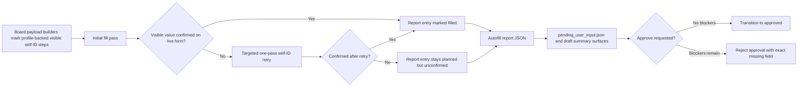

# fix: Enforce visible self-ID draft confirmation

## Overview

Visible, profile-backed self-ID fields can currently fall through the draft pipeline in two bad ways: some board runtimes mark those fields as filled without proving that the live UI retained the answer, and draft approval can proceed even when `submit/pending_user_input.json` already says fields remain unconfirmed. This plan makes visible configured self-ID answers a real draft-completion contract by carrying explicit blocker metadata through autofill reporting, retrying one targeted in-run confirmation pass, reusing the existing unconfirmed-field artifact path, and blocking approval until the missing field is resolved.

The first implementation slice stays focused on self-ID, not every profile-backed deterministic field. It should still establish a reusable pattern that future work can extend to other visible profile-backed questions without inventing a second artifact or review model.

## Problem Frame

The origin requirements document defines a clear product contract: if a supported board renders a visible self-ID field and `application_profile.md` has a truthful configured answer, the draft does not count as complete until the live form visibly shows that answer (see origin: `docs/brainstorms/2026-03-26-visible-self-id-confirmation-requirements.md`).

Repo research surfaced four concrete gaps behind the current Ashby ethnicity miss:

- `scripts/autofill_pipeline.py` already writes `planned_but_unconfirmed_fields` into `submit/pending_user_input.json`, but the shared pipeline has no explicit concept of an optional visible self-ID field that must still block completion.
- `scripts/autofill_ashby.py` and several other single-page board adapters build deterministic self-ID steps from `application_profile.md`, yet their `_fill_step()` flows often mark `filled = True` immediately after a click or selection rather than after re-reading the rendered control.
- `scripts/autofill_greenhouse.py` already performs richer runtime confirmation for visible demographics, but `record_unconfirmed_fields()` explicitly filters demographic fields out of the blocking pending-user-input path.
- `scripts/pipeline_orchestrator.py::approve_job()` transitions any `draft` to `approved` without checking for current unresolved blocker artifacts, so an incomplete draft can still be queued for submission.

The product already has the right building blocks: screenshot-first verification, `planned_but_unconfirmed_fields`, `pending_user_input.json`, TUI attention rendering, and draft-summary artifacts. The missing piece is a shared contract that tells those seams which visible configured self-ID fields are blockers and keeps approval from bypassing them.

## Requirements Trace

- R1. Define one shared draft-completion contract for visible configured self-ID fields.
- R2. Treat visible self-ID fields backed by truthful profile values as incomplete until the live form confirms them.
- R3. Cover the self-ID slice broadly: race/ethnicity, gender, gender identity, transgender status, pronouns, sexual orientation, veteran status, disability status, and similar prompts when configured.
- R4. Retry one targeted self-ID fill-and-confirm pass inside the same draft run before concluding failure.
- R5. If confirmation still fails, record the exact missing field and keep the draft incomplete through the existing artifact path.
- R6. Make the incomplete state and missing field visible in normal draft-review surfaces, not just board-local logs.
- R7. Apply the contract across supported boards and surfaces, even if board rollout is phased by existing runtime/test coverage.
- R8. Treat visible live-form confirmation as authoritative, not hidden inputs or planned intent.
- R9. Preserve existing truthful self-ID policy from `application_profile.md`.
- R10. Establish a reusable pattern for future visible profile-backed confirmation work without broadening scope beyond self-ID now.

## Scope Boundaries

- Do not broaden this work to every visible profile-backed deterministic field.
- Do not change any truthful self-ID values in `application_profile.md`.
- Do not make visible optional self-ID fields skippable when a truthful configured answer exists.
- Do not invent a second incomplete-draft artifact or a new submission workflow when `planned_but_unconfirmed_fields` and `pending_user_input.json` already exist.
- Do not replace board-specific runtime confirmation logic with one brittle universal DOM parser.

## Context & Research

### Relevant Code and Patterns

- `scripts/autofill_common.py`
  - `write_report()` is the shared report seam for most browser boards.
  - The common `_report_entry()` shape is currently thinner than Greenhouse's custom report entry and drops metadata that would help reviewers.
- `scripts/autofill_pipeline.py`
  - `run_browser_pipeline()` is the shared single-page browser flow.
  - It already turns `planned_but_unconfirmed_fields` into `submit/pending_user_input.json` before submit, but it has no explicit blocker class for visible configured self-ID fields.
- `scripts/application_submit_common.py`
  - `pending_user_input_questions_for_unconfirmed_fields()` already converts report entries into actionable review artifacts with `planned_value`, `note`, and `page_index` when the report provides them.
- `scripts/autofill_ashby.py`
  - Deterministic self-ID step builders already exist for gender, transgender status, race/ethnicity, veteran status, disability status, sexual orientation, communities, and pronouns.
  - `_fill_step()` sets `filled = True` immediately after successful click/select flows, which is appropriate for many fields but too optimistic for the new contract.
- `scripts/autofill_lever.py`, `scripts/autofill_gem.py`, `scripts/autofill_eightfold.py`, `scripts/autofill_smartrecruiters.py`, `scripts/autofill_reducto.py`
  - These shared-pipeline boards already have deterministic self-ID handlers and are the closest follow-on adopters of the contract after Ashby.
- `scripts/autofill_greenhouse.py`
  - `sync_runtime_confirmations()` already reads visible demographic answers from the live form and writes them into `runtime["extra_report_steps"]`.
  - `record_unconfirmed_fields()` currently exempts demographic fields from blocking pending-user-input behavior.
- `scripts/autofill_workday.py`, `scripts/autofill_icims.py`, `scripts/autofill_phenom.py`
  - These boards have custom demographic-page flows that can adopt the same artifact contract once the shared blocker shape is stable.
- `scripts/draft_manager.py`
  - `generate_draft_summary()` currently renders only `report["fields"]`, so mixed "filled plus unconfirmed" drafts hide the missing fields in `draft_summary.md` and `.png`.
- `scripts/job_tui.py`
  - The attention pane already reads `pending_user_input.json` and shows planned values; this is a strong pattern to preserve.
- `scripts/output_layout.py`
  - `active_submit_dir_name()` and `role_submit_dir()` already define the current submit attempt and are safer than scanning every historical `submit-*` directory during approval checks.
- `scripts/submit_application.py`
  - `_pending_user_input_for_current_attempt()` already treats the active submit directory plus freshness timing as the durable pattern for deciding whether a blocker belongs to the current run.
- `scripts/job_web.py`, `scripts/draft_web.py`, `scripts/static/app.js`, `bin/job-assets`
  - Approval and review surfaces already exist, but approval does not distinguish incomplete drafts and the web answers tab only falls back to unconfirmed fields when there are zero filled fields.
  - `job_web.py` already applies `LocalOnlyMiddleware` for `127.0.0.1`/`::1`/`localhost`, and `draft_web.py` binds to `127.0.0.1` by default. The plan should preserve that local-review boundary rather than widening self-ID visibility into new surfaces or logs.
- `scripts/pipeline_orchestrator.py`
  - `approve_job()` is the real approval seam shared by web, TUI, draft web, and CLI.

### Institutional Learnings

- `docs/solutions/logic-errors/fragile-question-classifier-regression-cascade.md`
  - Cross-board behavior should be centralized at shared seams where possible, then regression-tested so per-board drift does not reappear.
- `docs/solutions/workflow-issues/explicit-answer-regeneration-requires-durable-fresh-proof-2026-03-26.md`
  - User trust should be grounded in durable artifacts and visible proof, not status assumptions. The same principle applies here: planned answers are not proof.
- `docs/solutions/patterns/critical-patterns.md`
  - Not present in this repo. No additional critical-pattern document was available.

### External References

- None. The repo already has enough local evidence and established patterns for a grounded plan.

## Key Technical Decisions

- Represent "visible configured self-ID blocker" explicitly in autofill step/report metadata rather than inferring it only from labels at review time.
  Rationale: board runtimes already know which steps came from truthful self-ID profile data. Encoding that at the source is less brittle than reverse-engineering it from `pending_user_input.json`.

- Keep visible confirmation board-local, but standardize the blocker/report contract in shared seams.
  Rationale: Greenhouse, Ashby, and wizard boards expose different DOM structures. The shared layer should decide blocking and artifact shape, while board runtimes remain responsible for proving what is visibly selected.

- Reuse `planned_but_unconfirmed_fields` and `submit/pending_user_input.json` as the single incomplete-draft artifact chain.
  Rationale: TUI, web logs, and submit gating already consume that path. A second artifact would create drift.

- Retry one targeted self-ID fill-and-confirm pass per run or page before finalizing blockers.
  Rationale: transient React/UI misses are real, but repeated blind retries would hide persistent bugs and make screenshots less trustworthy.

- Gate approval on the absence of current blocker artifacts.
  Rationale: otherwise a draft can remain incomplete in artifacts yet still transition to `approved` and later submit. The check should key off the active submit directory pointer and current-run blocker freshness rather than every historical `submit-*` directory.

- Review surfaces must render blocker state explicitly, with blockers separated from confirmed answers and richer planned values confined to dedicated review panes.
  Rationale: `draft_summary.md` and the web answers tab currently hide mixed states, which makes the contract easy to miss even when the artifact exists. A fixed blockers-first hierarchy also reduces reviewer confusion without copying sensitive self-ID values into generic toasts, queue rows, or timeline events.

- Roll out by shared seam plus board families, not by one-off bug fixes.
  Rationale: the origin requirements document explicitly rejects an Ashby-only race/ethnicity fix. Shared-pipeline boards and Greenhouse should inherit the same contract pattern, while custom wizard boards follow after characterization coverage.

- Phase 2 rollout is conditional on a Phase 1 acceptance gate, not automatic.
  Rationale: the current evidence is strongest for Ashby/Greenhouse-class misses. Less-tested boards should only absorb the contract after Phase 1 proves the blocker path works end-to-end and board-local characterization shows the same confirmation gap or missing artifact behavior.

## Open Questions

### Resolved During Planning

- Which seam should own the contract?
  The contract should be split cleanly: shared report/blocker shaping in `scripts/autofill_common.py` and `scripts/application_submit_common.py`, shared single-page orchestration in `scripts/autofill_pipeline.py`, and board-local visible confirmation inside each board runtime.

- What counts as a "visible" self-ID field?
  A field counts as visible only when the runtime can re-read the rendered control or rendered section and prove the expected value is present. Hidden backing inputs or planned values alone do not satisfy the contract.

- Where should the retry happen?
  Inside the active draft run, before screenshots and report finalization, and only for targeted visible configured self-ID blockers.

- How should the missing-field state surface?
  Through the existing report JSON plus `pending_user_input.json`, draft summary artifacts, answers/review surfaces, and approval-error messaging.

- What hierarchy should review surfaces use for mixed confirmed/unconfirmed drafts?
  Use one consistent structure everywhere: a blockers-first "Needs Review" section sourced from unconfirmed artifacts, followed by the existing confirmed-answer list. TUI attention remains the alert-oriented exception and should keep its compact pending-user-input view.

- When should Phase 2 begin?
  Only after Phase 1 proves the shared blocker contract on the currently evidenced boards and characterization or spot-checking shows the same missing-confirmation risk on each Phase 2 board family before rollout starts there.

### Deferred to Implementation

- Exact metadata field names for the blocker annotation, as long as the report and pending-user-input chain can preserve them without board-specific parsing.
- The precise ordering for rolling the contract from shared-pipeline boards to less-tested wizard boards, as long as the rollout plan remains explicit and regression-backed.
- Whether approval failures should return a richer structured payload or a simpler error string, as long as web/TUI/CLI can distinguish "incomplete draft" from "wrong status."

## High-Level Technical Design

> *This illustrates the intended approach and is directional guidance for review, not implementation specification. The implementing agent should treat it as context, not code to reproduce.*

## Implementation Units

- [ ] **Unit 1: Add shared blocker metadata and unconfirmed-field policy**

**Goal:** Define one shared artifact contract for visible configured self-ID blockers and teach the common report/pending-user-input path to preserve it.

**Requirements:** R1, R2, R5, R6, R8, R9, R10

**Dependencies:** None

**Files:**
- Modify: `scripts/autofill_common.py`
- Modify: `scripts/autofill_pipeline.py`
- Modify: `scripts/application_submit_common.py`
- Modify: `tests/test_autofill_common.py`
- Modify: `tests/test_autofill_pipeline.py`
- Modify: `tests/test_submit_application.py`

**Approach:**
- Extend the shared report-entry shape so shared-pipeline boards can preserve the same useful fields Greenhouse already writes, including `optional`, `note`, `page_index`, and explicit blocker metadata for visible configured self-ID steps.
- Add a shared policy helper that decides which unconfirmed report entries block draft completion: required unconfirmed fields plus planned visible configured self-ID entries, even when the board marks them optional.
- Keep non-self-ID optional skips on their current non-blocking path so this change does not widen scope accidentally.
- Add an opt-in single-page retry hook in `run_browser_pipeline()` that boards can use for one targeted self-ID re-fill/reconfirm pass before screenshots and final report writing.
- Ensure `pending_user_input_questions_for_unconfirmed_fields()` carries enough reviewer context forward from the report entry shape instead of forcing later surfaces to rediscover it.

**Patterns to follow:**
- `scripts/autofill_common.py::write_report()`
- `scripts/application_submit_common.py::write_pending_user_input_for_unconfirmed_fields()`
- `scripts/autofill_greenhouse.py::_report_entry()` for richer report metadata

**Test scenarios:**
- Optional non-self-ID fields remain non-blocking when skipped or unconfirmed.
- Optional visible self-ID blocker entries flow into `planned_but_unconfirmed_fields` and `pending_user_input.json`.
- Pending-user-input payloads preserve `planned_value`, `note`, and `page_index` when the report provides them.
- Shared single-page retry infrastructure runs at most once for targeted blocker entries.

**Verification:**
- Shared report JSON can distinguish ordinary optional skips from visible configured self-ID blockers without board-local log inspection.

- [ ] **Unit 2: Adopt the contract on shared-pipeline boards with deterministic self-ID handlers**

**Goal:** Update single-page board adapters that already derive self-ID answers from `application_profile.md` so they only mark those steps filled after live confirmation and opt into the shared blocker contract.

**Requirements:** R2, R3, R4, R5, R7, R10

**Dependencies:** Unit 1

**Files:**
- Modify: `scripts/autofill_ashby.py`
- Modify: `scripts/autofill_lever.py`
- Modify: `scripts/autofill_gem.py`
- Modify: `scripts/autofill_eightfold.py`
- Modify: `tests/test_ashby_autofill.py`
- Modify: `tests/test_lever_autofill.py`
- Modify: `tests/test_gem_autofill.py`
- Modify: `tests/test_eightfold_autofill.py`

**Approach:**
- Focus Phase 1 on the shared-pipeline boards that already have self-ID coverage or the tightest nearby patterns: Ashby, Lever, Gem, and Eightfold.
- Mark deterministic self-ID steps built from `application_profile.md` as visible-blocker candidates when the field is expected to render visibly on the form.
- Tighten each board's `_fill_step()` or equivalent confirmation path so those steps are only marked filled after the rendered selection, input value, or section text matches the intended answer.
- Reuse each board's existing selector vocabulary instead of adding one generic DOM parser; Ashby, Lever, Gem, and Eightfold all expose different control shapes.
- Opt those boards into the shared one-pass retry hook for visible configured self-ID steps that remain unconfirmed after the first interaction.
- Keep truly absent self-ID fields on the existing "not present on page" path so boards do not block on controls that were never rendered.

**Execution note:** Less-tested shared-pipeline boards move to Unit 4 after the Phase 1 acceptance gate rather than expanding this first slice immediately.

**Patterns to follow:**
- Existing deterministic self-ID step builders in each board file
- Ashby's existing cover-letter text/file confirmation pattern for live re-read after fill

**Test scenarios:**
- Visible race/ethnicity, pronouns, or veteran/disability fields become blockers when the control does not retain the expected value.
- Hidden or non-rendered self-ID fields do not create blockers.
- The second targeted pass can recover a transient miss once, but persistent failures remain planned/unconfirmed.
- Non-self-ID fields on those boards retain current fill behavior.

**Verification:**
- Shared-pipeline boards no longer report draft-complete when a visible configured self-ID field remains blank in the live UI.

- [ ] **Unit 3: Remove Greenhouse's demographic blocker exception and align its runtime confirmations**

**Goal:** Keep Greenhouse's custom visible-demographic runtime logic, but make its unconfirmed self-ID fields block through the same artifact path as other boards.

**Requirements:** R1, R2, R3, R5, R7, R8, R10

**Dependencies:** Unit 1

**Files:**
- Modify: `scripts/autofill_greenhouse.py`
- Modify: `tests/test_greenhouse_autofill.py`

**Approach:**
- Preserve `sync_runtime_confirmations()` and `runtime["extra_report_steps"]` as Greenhouse's source of truth for visible self-ID confirmation.
- Replace the current hard-coded demographic exemption in `record_unconfirmed_fields()` with the shared blocker policy from Unit 1.
- Continue distinguishing planned profile-backed self-ID confirmations from runtime-only optional widgets that were never planned from truthful profile data.
- Carry forward the current Greenhouse-specific details that matter for review, especially page-indexed confirmations and notes for demographic transforms like Hispanic/Latino handling.
- Re-run runtime confirmation after page transitions and security-code handling before final blocker evaluation so Greenhouse still benefits from its richer page-aware workflow.

**Patterns to follow:**
- `scripts/autofill_greenhouse.py::sync_runtime_confirmations()`
- `scripts/autofill_greenhouse.py::record_unconfirmed_fields()`
- Existing `extra_report_steps` and page-screenshot patterns

**Test scenarios:**
- Visible planned race/pronouns/self-ID controls that remain blank are no longer filtered out of blocking behavior.
- Runtime-only optional self-ID controls that were never planned stay non-blocking.
- Page-indexed demographic gaps preserve `page_index` and note details in report and pending-user-input artifacts.
- Existing cover-letter unconfirmed behavior remains unchanged.

**Verification:**
- Greenhouse self-ID gaps and shared-pipeline self-ID gaps surface through the same incomplete-draft artifact chain.

- [ ] **Unit 4: Extend the contract to phase-2 board families**

**Goal:** Extend the proven contract to less-tested shared-pipeline boards and wizard-style demographic flows only after Phase 1 validates the blocker path end to end.

**Requirements:** R1, R2, R3, R5, R7, R10

**Dependencies:** Unit 1

**Files:**
- Modify: `scripts/autofill_smartrecruiters.py`
- Modify: `scripts/autofill_reducto.py`
- Modify: `scripts/autofill_workday.py`
- Modify: `scripts/autofill_icims.py`
- Modify: `scripts/autofill_phenom.py`
- Create: `tests/test_smartrecruiters_autofill.py`
- Create: `tests/test_reducto_autofill.py`
- Create: `tests/test_workday_autofill.py`
- Create: `tests/test_icims_autofill.py`
- Create: `tests/test_phenom_autofill.py`

**Approach:**
- Start with characterization coverage on `smartrecruiters` and `reducto` to confirm whether the same planned-vs-visible self-ID gap exists before tightening their blocker behavior.
- Characterize each wizard board's existing demographics-page reporting first, then add visible-blocker metadata and live confirmation requirements to the steps they already emit.
- Treat those boards as board-local confirmation domains: the shared layer only decides blocking and artifacts after the board runtime proves or fails to prove the visible value.
- When a demographics page remains unresolved after its single retry boundary, record the exact field and page in unconfirmed artifacts rather than silently advancing the wizard.
- Keep non-self-ID wizard questions on their current path.

**Execution note:** Do not start this unit until Phase 1 acceptance criteria are met and the target board shows either the same confirmation gap or a missing blocker-artifact path during characterization.

**Patterns to follow:**
- Existing deterministic self-ID step builders in `scripts/autofill_smartrecruiters.py` and `scripts/autofill_reducto.py`
- `scripts/autofill_workday.py` demographic page helpers
- `scripts/autofill_icims.py::_fill_demographics_page()`
- `scripts/autofill_phenom.py` voluntary-disclosures and self-identity step handlers

**Test scenarios:**
- Visible shared-pipeline self-ID controls on SmartRecruiters/Reducto become blockers when their rendered values are not retained.
- Visible wizard-page self-ID controls become blockers when their values are not retained.
- Page advancement does not hide unresolved planned self-ID gaps.
- Non-self-ID wizard behavior remains stable.

**Verification:**
- Phase 2 boards produce the same blocker artifacts as Phase 1 boards when visible configured self-ID confirmation fails.

- [ ] **Unit 5: Surface incomplete self-ID drafts in review artifacts and block approval**

**Goal:** Make unresolved self-ID blockers visible in draft review outputs and prevent approval from bypassing them across CLI, TUI, draft web, and the main web UI.

**Requirements:** R5, R6, R7, R8, R10

**Dependencies:** Units 1-3

**Files:**
- Modify: `scripts/draft_manager.py`
- Modify: `scripts/pipeline_orchestrator.py`
- Modify: `scripts/job_web.py`
- Modify: `scripts/job_tui.py`
- Modify: `scripts/draft_web.py`
- Modify: `scripts/static/app.js`
- Modify: `bin/job-assets`
- Modify: `tests/test_draft_manager.py`
- Modify: `tests/test_job_web.py`
- Modify: `tests/test_draft_web.py`
- Modify: `tests/test_job_assets_cli.py`

**Approach:**
- Update draft-summary generation to render a dedicated `Needs Review` section before the confirmed-answer list so `draft_summary.md` and `draft_summary.png` no longer hide mixed states. Each blocker entry should carry the label plus `planned_value`, `note`, and `page_index` when present.
- Update the web answers/review UI to mirror the same hierarchy: `Needs Review` first, confirmed answers second, instead of falling back to unconfirmed fields only when there are zero filled answers.
- Preserve TUI attention's existing `pending_user_input.json` rendering as the fast alert view, and keep draft web aligned by inheriting the new summary structure rather than inventing a second layout.
- Keep richer planned self-ID values inside those dedicated review surfaces; approval toasts, CLI/TUI status lines, and timeline/event text should surface the missing field label and incomplete-draft reason without echoing the full answer.
- Change the approval seam from a status-only check to a status-plus-completeness check by consulting the active/current submit attempt's unresolved blocker artifact before transitioning to `approved`.
- Return or surface an approval outcome taxonomy with at least `approved`, `incomplete_draft`, and `invalid_status` so web, TUI, CLI, and draft web can tell the user the draft is incomplete rather than merely "not in draft status," even if the final transport shape differs.

**Patterns to follow:**
- `scripts/job_tui.py` attention rendering from `pending_user_input.json`
- `scripts/static/app.js` answers tab rendering
- `scripts/pipeline_orchestrator.py::approve_job()` as the shared approval seam
- `scripts/output_layout.py::role_submit_dir()` / `active_submit_dir_name()` for current-attempt resolution
- `scripts/submit_application.py::_pending_user_input_for_current_attempt()` for freshness checks that ignore stale blocker artifacts

**Test scenarios:**
- `draft_summary.md` and the web answers tab both show a blockers-first `Needs Review` section when filled answers and unconfirmed blockers coexist.
- Approval is rejected when the active/current draft still has blocker artifacts, succeeds when they are cleared, and ignores stale historical `submit-*` blockers from older attempts.
- Web, TUI, draft web, and CLI approval paths surface the incomplete-draft reason distinctly from wrong-status failures.
- Approval-related toasts and generic status text surface the missing field label without repeating the full planned self-ID answer outside dedicated review panes.
- The web answers tab shows mixed filled plus unconfirmed data (manual verification if no JS harness exists).

**Verification:**
- An incomplete self-ID draft cannot transition to `approved`.
- Reviewers can see the exact missing field in normal draft-review surfaces without opening board-specific logs, and every surface uses the same blockers-first hierarchy.

## System-Wide Impact

- **Interaction graph:** `application_profile.md` -> board payload builders -> board runtime confirmation -> shared report JSON -> `pending_user_input.json` -> `draft_summary.md` / `draft_summary.png` / TUI attention / web answers tab -> `approve_job()`.
- **Error propagation:** Unconfirmed visible self-ID fields should remain artifact-driven draft blockers, not board-local fatal exceptions during draft mode. Submit attempts can still stop before submit using the existing unresolved-field path.
- **State lifecycle risks:** Approval gating must read the active submit directory (`output_layout.role_submit_dir()`) and apply a current-attempt freshness check similar to `submit_application.py::_pending_user_input_for_current_attempt()`, not a stale historical `submit-*` directory, or old blockers will incorrectly block new drafts.
- **Review-surface hierarchy:** Draft summary, draft web, and the main web answers tab should all present `Needs Review` before confirmed answers so reviewers do not have to guess where mixed-state blockers appear. TUI attention remains a compact alert surface sourced from the same artifact.
- **Sensitive-data exposure:** The main web UI is already restricted by `LocalOnlyMiddleware`, and draft review currently binds to `127.0.0.1` by default. This work should stay inside those local review surfaces and avoid copying full planned self-ID answers into queue tables, events, or generic approval messaging.
- **API surface parity:** Web, TUI, draft web, and CLI all rely on `approve_job()` and should surface the same three approval outcomes: approved, incomplete draft, invalid status.
- **Integration coverage:** Automated tests should cover report shaping, pending-user-input generation, board runtime confirmation, and approval gating together. Manual browser verification remains valuable for boards with React-heavy self-ID widgets.

## Risk Analysis & Mitigation

- **Risk:** Over-blocking runtime-only optional self-ID widgets that were never planned from truthful profile data.
  **Mitigation:** Only block explicit profile-backed self-ID steps or explicit runtime confirmations tied to those configured values.

- **Risk:** Board-specific DOM variance makes a shared confirmation parser brittle.
  **Mitigation:** Keep confirmation logic local to board runtimes and standardize only metadata, report shaping, retry boundaries, and approval gating.

- **Risk:** Stale `pending_user_input.json` artifacts block approval after a successful rerun.
  **Mitigation:** Gate approval on the active/current submit attempt artifact path via `output_layout.role_submit_dir()` and apply the same freshness check pattern already used by `_pending_user_input_for_current_attempt()`.

- **Risk:** Review surfaces drift, leaving some paths informative and others silent.
  **Mitigation:** Drive summaries, TUI attention, and web answers from the same report/pending-user-input artifacts and lock in a shared blockers-first hierarchy (`Needs Review`, then confirmed answers) so mixed states look the same everywhere.

- **Risk:** Surfacing blockers more prominently leaks sensitive self-ID values into broader status surfaces.
  **Mitigation:** Keep full planned values inside dedicated local review panes (`draft_summary.*`, draft web, web answers tab, TUI attention) and keep queue rows, event logs, and approval toasts limited to the missing field label plus incomplete-draft reason.

- **Risk:** Broad board rollout without tests reintroduces regressions similar to prior question-classifier drift.
  **Mitigation:** Keep Phase 1 limited to the boards with current evidence or existing self-ID coverage, then require characterization evidence before rolling the contract into each Phase 2 board family.

## Phased Delivery

### Phase 1

- Land the shared blocker/report contract, shared retry infrastructure, Greenhouse blocker fix, approval gating, and shared-pipeline boards with existing self-ID tests (`ashby`, `lever`, `gem`, `eightfold`).
- Surface blockers clearly in draft artifacts and approval flows.
- Acceptance gate before Phase 2:
  - The shared contract catches the Ashby/Greenhouse-class miss through blocker artifacts and screenshots rather than relying on board-local logs.
  - `approve_job()` rejects active-attempt blocker artifacts while ignoring stale historical `submit-*` artifacts.
  - Draft summary, draft web, and the main web answers tab all show the same blockers-first `Needs Review` hierarchy.
  - No new generic queue, event, or toast surface exposes full planned self-ID answers outside dedicated review panes.

### Phase 2

- Extend the same contract to less-tested shared-pipeline boards (`smartrecruiters`, `reducto`) and wizard-style demographic boards (`workday`, `icims`, `phenom`) only when characterization or spot-checking shows the same confirmation gap or blocker-artifact gap on that board family.
- Roll boards in one family at a time so Phase 1 learns can be applied before widening the regression surface again.

## Documentation / Operational Notes

- Update `docs/autofill-patterns.md` once implementation lands so the visible-self-ID blocker contract is documented beside the existing demographic handling notes.
- If approval gating changes user-visible messaging, keep CLI/TUI/web wording aligned so "incomplete draft" has one meaning everywhere.
- If draft review is ever exposed beyond the current local-only defaults, treat blocker payload rendering as a separate security decision rather than automatically inheriting the richer self-ID surfaces from this plan.

## Sources & References

- **Origin document:** [docs/brainstorms/2026-03-26-visible-self-id-confirmation-requirements.md](../brainstorms/2026-03-26-visible-self-id-confirmation-requirements.md)
- Related code: [autofill_pipeline.py](../../scripts/autofill_pipeline.py)
- Related code: [autofill_common.py](../../scripts/autofill_common.py)
- Related code: [autofill_greenhouse.py](../../scripts/autofill_greenhouse.py)
- Related code: [autofill_ashby.py](../../scripts/autofill_ashby.py)
- Related code: [application_submit_common.py](../../scripts/application_submit_common.py)
- Related code: [pipeline_orchestrator.py](../../scripts/pipeline_orchestrator.py)
- Related code: [draft_manager.py](../../scripts/draft_manager.py)
- Related code: [output_layout.py](../../scripts/output_layout.py)
- Related code: [submit_application.py](../../scripts/submit_application.py)
- Related code: [job_web.py](../../scripts/job_web.py)
- Related code: [draft_web.py](../../scripts/draft_web.py)
