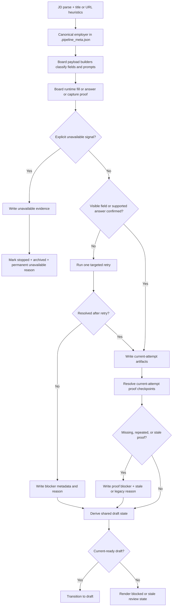

# fix: Enforce shared draft-proof contract

## Overview

Broaden the earlier self-ID-only draft blocker work into one shared product contract for draft readiness. A run should only land in `draft` when the live form, generated answers, truthful profile-backed answers, and required proof artifacts all support what the product claims happened. When the live posting is explicitly unavailable, the job should stop as a permanent unavailable outcome and auto-archive. When the proof or state comes from an older attempt, the product should present that as stale or legacy, not as the current draft.

This plan updates the existing shared-draft-proof plan in place to match the widened origin document (see origin: `docs/brainstorms/2026-03-26-visible-self-id-confirmation-requirements.md`). The earlier narrower self-ID plan remains historical context only.

Execution posture: characterization-first on shared seams, attempt-scoped proof resolution, and review-surface state semantics. The repo already has strong regression coverage around current-attempt artifacts, stale answer caches, sponsorship classification, and queue freshness, so implementation should lock the broadened edge cases in tests before widening behavior.

## Problem Frame

The origin document now frames the reported bugs as one contract failure, not a pile of board-local misses. Recent runs can still appear current or successful when:

- visible profile-backed deterministic fields such as current location, phone number, LinkedIn URL, gender, race, or age range are blank or wrong on the live form
- work-location choices ignore the candidate's San Francisco preference even when San Francisco is offered
- employer identity is derived from wrapper text like `The Role` rather than the actual employer
- answerable screening questions regress to blank
- truthful compliance-sensitive prompts stall because the UI expects short prose instead of a simple yes or no control
- biography or work-history questions drift away from authoritative candidate materials
- a linked screening task, such as the SQL example, is left unanswered even though the prompt provides an accessible resource
- required screenshot proof is missing, repeated, or missing the final review or approve-and-submit surface
- stale or legacy draft artifacts are still treated as the current draft
- the page explicitly says the application is unavailable, but the job is not archived and the reason is not surfaced cleanly

Repo research shows the building blocks already exist, but they stop short of a shared contract:

- `scripts/autofill_common.py`, `scripts/autofill_pipeline.py`, and `scripts/application_submit_common.py` already support blocker metadata, `planned_but_unconfirmed_fields`, current-attempt artifact lookup, and `pending_user_input.json`, but the taxonomy is still too narrow for stale or legacy proof, repeated screenshots, final review proof, and broader truthful answer classes.
- `tests/test_submit_application.py` and `tests/test_greenhouse_autofill.py` already characterize stale answer-cache rejection, pending-user-input freshness, company-history prompts, and the SQL example, but the plan does not yet turn those seams into one explicit draft contract.
- `tests/test_lever_autofill.py`, `tests/test_ashby_autofill.py`, and `tests/test_autofill_linkedin.py` show that sponsorship and work-authorization semantics already exist on a truthful path, but freeform prose variants are not yet planned as first-class supported outputs.
- `scripts/pipeline_orchestrator.py::_validate_draft_completeness()` already rejects stale `submit/` screenshots in favor of the active attempt, but the contract does not yet cover repeated screenshot reuse, missing final review proof, or stale/legacy draft presentation.
- `docs/solutions/workflow-issues/explicit-answer-regeneration-requires-durable-fresh-proof-2026-03-26.md` and `docs/solutions/ui-bugs/redrafted-queue-rows-showed-stale-completion-age-2026-03-26.md` show that freshness and state semantics need to be centralized and artifact-backed, not inferred locally by each surface.

## Requirements Trace

- R1. Define one shared cross-board draft-proof contract covering draft readiness, stale or legacy draft semantics, and explicit unavailable handling.
- R2. Use the actual posting employer for filenames, review surfaces, and logs.
- R3. Treat visible profile-backed deterministic fields as unready until the live UI confirms them.
- R4. Source current-residence and current-location prompts from the candidate profile, not the job location.
- R5. Prefer San Francisco for work-location preference or availability prompts when offered, unless the prompt explicitly requires multiple selections.
- R6. Prevent discrete positive-fit prompts and other supported answerable prompts from silently regressing to blank or weaker output.
- R7. Keep compliance-sensitive answers on their truthful path and require truthful fill or confirmation when the UI shows them.
- R8. Keep biography and employment-history claims grounded in authoritative candidate materials rather than optimism or fabrication.
- R9. Generate truthful prose answers for supported non-yes-no compliance prompts instead of stalling.
- R10. Use directly linked, accessible screening resources during the draft attempt when the runtime can support them.
- R11. Require current-attempt proof artifacts, including the screenshot evidence the product claims it captured and the final review or approve-and-submit surface when present.
- R12. Treat repeated screenshot reuse across distinct required checkpoints as invalid proof unless the checkpoints are explicitly the same.
- R13. Retry one targeted in-run recovery pass before concluding failure.
- R14. Fail closed as incomplete when required fields, answers, or proof remain missing after retry.
- R15. Convert explicit posting unavailability into a durable auto-archived outcome with evidence and logging.
- R16. Surface the exact missing, wrong, regressed, stale, legacy, or unavailable reason across normal review surfaces.
- R17. Distinguish current active drafts, blocked incomplete drafts, stale or legacy drafts, and explicit unavailable archived outcomes.
- R18. Do not let legacy artifacts satisfy the current draft-proof contract unless they are explicitly matched to the active attempt.
- R19. Preserve existing truthful and compliance-sensitive answer policies rather than widening them into fabrication.
- R20. Apply the contract across supported boards and runtime surfaces, with phased rollout allowed.

## Scope Boundaries

- Do not change the `--draft` rule or auto-submit behavior.
- Do not broaden affirmative defaults to compensation, sponsorship, work authorization, age, or self-ID questions that must remain truthful and profile-driven.
- Do not invent factual biography such as past employers or startup experience beyond what the authoritative candidate materials support.
- Do not require every open-ended question to be answered automatically. The contract applies only to fields or prompts the product already treats as deterministic, profile-backed, or supported generated-answer work.
- Do not create a brand-new review workflow when `pending_user_input.json`, draft summaries, and existing web and TUI review surfaces can carry the blocker state.
- Do not auto-archive transient service interruptions, captcha states, or ambiguous auth failures. Only explicit posting or application unavailability should archive automatically.
- Do not require multi-location selections unless the prompt itself explicitly requires them.
- Do not treat inaccessible external tasks as silently successful. If the runtime cannot access or solve a required linked task within the supported draft flow, it must surface that as incomplete instead of fabricating success.

## Context & Research

### Technology & Infrastructure

- Python 3.12 flat-scripts repo with Playwright board submitters, raw-SQL SQLite state in `scripts/job_db.py`, FastAPI local web surfaces, and Textual TUI.
- Draft and submit artifacts live under per-role output directories with active submit-attempt helpers in `scripts/output_layout.py` and current-attempt pending-user-input loading in `scripts/application_submit_common.py`.
- Shared autofill architecture is intentionally split: board-local runtime logic in `scripts/autofill_{board}.py`, shared browser and report helpers in `scripts/autofill_common.py` and `scripts/autofill_pipeline.py`, and shared answer and question policy in `scripts/application_submit_common.py` and `scripts/question_classifier.py`.

### Relevant Code and Patterns

- `scripts/autofill_common.py`
  - Existing blocker metadata and report shaping (`blocks_draft_completion`, `blocker_kind`, `profile_field`)
  - `board_file_constants()` already defines canonical board-specific proof artifact names
- `scripts/application_submit_common.py`
  - Shared profile parsing, question policy helpers, current-attempt artifact loading, pending-user-input shaping, and shared work-location helpers
  - Existing seams for current-attempt freshness, company-history detection, and supported answer generation
- `scripts/autofill_pipeline.py`
  - Single-page runtime flow, one-pass retry hook, report writing, and current-attempt pending-user-input generation
- `scripts/question_classifier.py`
  - Central classification seam for deterministic, supported, and specialized prompts
- `scripts/submit_application.py`
  - Shared generated-answer path and cache-bypass behavior for supported prompts
- `scripts/autofill_greenhouse.py`
  - Current-residence logic, parallel generated-answer flow, and explicit `job_closed` detection
- `scripts/autofill_ashby.py`, `scripts/autofill_lever.py`, `scripts/autofill_linkedin.py`
  - Existing truthful sponsorship or work-authorization handling, visible-field confirmation patterns, and location or demographic widgets on the boards implicated by the note
- `scripts/pipeline_orchestrator.py`
  - Job state transitions, answer-refresh finalization, current approval gate, draft completeness enforcement, and explicit unavailable archiving
- `scripts/job_db.py`, `scripts/job_web.py`, `scripts/job_tui.py`, `scripts/draft_manager.py`, `scripts/static/app.js`
  - Shared serialization and review surfaces that must present current vs stale state consistently

### Institutional Learnings

- `docs/solutions/logic-errors/visible-self-id-draft-blockers-2026-03-26.md`
  - Use blocker metadata at the runtime seam and drive approval or review from current-attempt artifacts, not optimistic status assumptions.
- `docs/solutions/logic-errors/fragile-question-classifier-regression-cascade.md`
  - Keep shared question semantics centralized, backed by regression tests and real-label characterization, instead of reintroducing board-local keyword drift.
- `docs/solutions/workflow-issues/explicit-answer-regeneration-requires-durable-fresh-proof-2026-03-26.md`
  - Treat freshness as a durable artifact-backed workflow contract, not as a status hint.
- `docs/solutions/ui-bugs/redrafted-queue-rows-showed-stale-completion-age-2026-03-26.md`
  - State and freshness presentation should be centralized in shared serializers so queue, job detail, and TUI do not drift.
- `docs/solutions/logic-errors/submit-attempt-scoped-confirmation-email-replies.md`
  - Current submit-attempt scoping is the right dedupe and proof boundary for side effects and artifact lookup.

### External References

- None. The repo already contains the relevant architecture, tests, and institutional learnings. External documentation would add less value than following the local patterns above.

## Flow and Edge-Case Analysis

### Primary Flows

1. **Successful current draft**
   - Employer identity is resolved correctly.
   - Board runtime fills and confirms visible profile-backed fields.
   - Supported screening prompts produce truthful control answers, truthful prose answers, or source-backed generated answers as appropriate.
   - Required proof artifacts exist in the current submit attempt, including final review proof when the board exposes it.
   - No blocker or stale-proof reason remains, so the job transitions to `draft`.

2. **Visible profile-backed field mismatch**
   - Runtime plans a value for current location, phone, LinkedIn URL, age range, or self-ID.
   - Live UI does not confirm the value.
   - One targeted retry runs.
   - If still unconfirmed, the field becomes a blocker in report, pending-user-input, and review surfaces, and approval stays blocked.

3. **Truthful prose or source-backed answer**
   - Prompt is not a simple yes or no control but is answerable from existing candidate truth or materials.
   - Shared answer policy emits truthful prose or a source-backed answer.
   - If the answer is blank or unsupported after retry, the prompt becomes a blocker rather than silently disappearing.

4. **Linked screening task**
   - Prompt includes a directly linked resource or exercise.
   - If the runtime can access and solve the resource within the supported draft flow, the answer is produced and captured as current-attempt proof.
   - If the task is inaccessible or unsupported, the run surfaces it as incomplete instead of claiming draft success.

5. **Proof missing or repeated**
   - Runtime claims it captured pre-submit or final review proof.
   - Shared proof resolution checks the active attempt and required checkpoint keys.
   - If proof is missing, reused incorrectly, or only present in stale historical buckets, the draft stays incomplete with a concrete proof blocker.

6. **Stale or legacy draft evidence**
   - Job has draft-like artifacts from an older attempt or older checkpoint model.
   - Shared state resolution detects that the proof does not belong to the active attempt.
   - Queue, job detail, draft summary, and TUI surfaces render the draft as stale, legacy, or blocked instead of current-ready.

7. **Explicit unavailable posting**
   - Board runtime encounters an explicit unavailable signal such as 404, invalid shell, or closed posting text.
   - Runtime writes evidence and stops.
   - The orchestrator records a permanent unavailable failure, auto-archives the job, and surfaces the reason distinctly from ordinary incomplete drafts.

### Important Edge Cases

- Workday maintenance or service interruption must remain retryable `service_unavailable`, not auto-archived.
- Current-residence prompts and work-location preference prompts overlap lexically; the former must use the candidate profile, while the latter must prefer San Francisco when offered.
- Multi-select location prompts must not accidentally inherit single-select San Francisco-only behavior when the prompt explicitly requires multiple choices.
- Compliance-sensitive prompts that already have truthful select or radio behavior must not regress while adding truthful prose fallback for textareas or freeform controls.
- Biography questions such as startup experience or prior employers must stay source-backed and must not hallucinate employers absent from the candidate materials.
- Repeated screenshot detection should not rely on brittle pixel-level heuristics when checkpoint identity, artifact path, or duplicate file reuse is already sufficient.
- Missing final review or approve-and-submit proof is a draft-integrity failure even when the pre-submit screenshot exists.
- Stale `submit/` buckets, stale `pending_user_input.json`, and historical `completed_at` timestamps must not be mistaken for the current draft state.
- Linked screening tasks that require inaccessible auth, sandbox escape, or arbitrary open-ended external research should surface as unresolved, not silently pass.

## Key Technical Decisions

- Keep the existing top-level job-status model. Do not add a new top-level `stale_draft` or `unavailable` enum.
  Rationale: `scripts/job_db.py`, `scripts/pipeline_orchestrator.py`, `scripts/job_web.py`, and queue consumers already understand `draft`, `stopped`, and `archived`. The contract should add shared derived draft-state and reason fields instead of widening every status consumer.

- Generalize the current self-ID blocker metadata into a broader draft-blocker and proof-checkpoint taxonomy.
  Rationale: the shared report and pending-user-input chain already works. The missing piece is broader blocker categories and checkpoint reasons, not a second review artifact model.

- Use current submit-attempt artifact resolution as the single proof boundary for completeness validation and UI discovery.
  Rationale: this is already the right pattern for confirmation emails, stale answer-cache rejection, and pending-user-input freshness. It prevents stale `submit/` assumptions and historical-bucket leaks.

- Distinguish answer classes explicitly: visible deterministic fields, truthful prose prompts, source-backed biography prompts, linked screening tasks, and genuinely specialized manual prompts.
  Rationale: the widened origin document adds new supported answer shapes, but it does not justify treating every open-ended question as generatable.

- Keep compliance-sensitive answers truthful and profile-driven, while letting the renderer choose control vs prose output.
  Rationale: the bug is missing, stale, or unconfirmed truthful answers, not insufficiently aggressive policy.

- Keep biography and work-history claims source-backed from authoritative candidate materials instead of the positive-fit policy.
  Rationale: "have you worked at X" and "have you worked at a startup" are factual claims, not willingness prompts.

- Detect repeated screenshot proof from checkpoint identity and active-attempt artifact reuse before considering heavier heuristics.
  Rationale: the strongest signal is when the same path or artifact identity is being used to satisfy multiple distinct required proof checkpoints in one attempt.

- Treat linked screening tasks as in scope only when the prompt provides a directly accessible resource and the runtime can solve it within the supported draft attempt.
  Rationale: this keeps the contract grounded and prevents planning from smuggling in arbitrary open-ended internet research.

- Employer identity should be resolved before filenames and review surfaces are finalized, with generic wrappers explicitly rejected.
  Rationale: once `.pipeline_meta.json` and output filenames are wrong, downstream consumers inherit the wrong company automatically.

## Open Questions

### Resolved During Planning

- **Should stale or legacy draft state become a new top-level status?**
  - No. Keep top-level status stable and expose stale or legacy state through shared derived draft-state and reason fields.

- **How should repeated screenshot proof be detected?**
  - Start with active-attempt checkpoint identity, artifact path reuse, and optional duplicate file metadata. Defer heavier image-level heuristics unless characterization shows they are necessary.

- **Where should truthful prose answers and source-backed biography answers live?**
  - In shared answer policy helpers in `scripts/application_submit_common.py` and the shared answer-generation seam, with board runtimes only handling widget-specific rendering and extraction.

- **What is the planning boundary for linked screening tasks?**
  - Support directly linked, accessible, bounded tasks during the draft attempt. Route inaccessible or off-flow tasks to explicit incomplete or pending-user-input outcomes.

- **Should stale proof and queue freshness logic stay surface-local?**
  - No. Centralize shared derived state and freshness fields in common serializers so queue, job detail, TUI, and summaries stay aligned.

### Deferred to Implementation

- Exact field names for the shared derived draft-state and reason payload, as long as all surfaces consume the same source.
- Whether repeated screenshot detection needs file hashing in addition to path or checkpoint identity once characterization tests are written.
- The exact checkpoint list for boards that expose multiple review stages before the final approve-and-submit action.
- Whether linked-task fetching belongs in shared answer generation or in board-local preprocessors when session-bound browser context is required.

## High-Level Technical Design

> This is directional design guidance for review, not code to reproduce verbatim.

## Implementation Units

- [ ] **Unit 1: Generalize blocker metadata, proof checkpoints, and current-attempt resolution**

**Goal:** Replace the self-ID-only blocker contract with a shared blocker and proof-checkpoint taxonomy that can represent visible fields, truthful answer failures, stale or legacy proof, and required artifact checkpoints from the active submit attempt.

**Requirements:** R1, R11, R12, R13, R14, R16, R17, R18, R20

**Dependencies:** None

**Files:**
- Modify: `scripts/autofill_common.py`
- Modify: `scripts/application_submit_common.py`
- Modify: `scripts/autofill_pipeline.py`
- Modify: `scripts/output_layout.py`
- Modify: `tests/test_autofill_common.py`
- Modify: `tests/test_submit_application.py`
- Modify: `tests/test_autofill_pipeline.py`

**Approach:**
- Generalize blocker metadata so the shared report and pending-user-input chain can represent:
  - visible profile-backed field blockers
  - truthful or generated-answer blockers
  - required-proof blockers
  - stale or legacy proof reasons
- Promote the active submit-attempt artifact resolver into one shared helper that understands checkpoint keys, `board_file_constants()`, and active-attempt boundaries.
- Preserve or wrap the existing visible self-ID helper so already-fixed self-ID tests do not regress during expansion.
- Ensure `write_report()` and `pending_user_input_questions_for_unconfirmed_fields()` preserve blocker metadata, planned values, artifact keys, page indices, stale reasons, and reviewer context without forcing later surfaces to reverse-engineer them.
- Keep the shared single-page retry hook explicit and bounded so later units can plug in one retry for field confirmation, answer generation, or proof capture without hiding persistent failures.

**Patterns to follow:**
- `docs/solutions/logic-errors/visible-self-id-draft-blockers-2026-03-26.md`
- `docs/solutions/logic-errors/submit-attempt-scoped-confirmation-email-replies.md`
- `scripts/autofill_common.py::write_report()`
- `scripts/application_submit_common.py::load_pending_user_input_for_submit_attempt()`

**Test scenarios:**
- Existing self-ID blockers still serialize correctly through the shared report path.
- A visible non-self-ID blocker persists `planned_value`, `note`, and `profile_field`.
- A required-proof blocker can be serialized without a traditional form field.
- Current-attempt artifact resolution finds the active submit screenshot or report and ignores stale historical buckets.
- Optional non-blocking fields stay non-blocking.

**Verification:**
- Shared report JSON and `pending_user_input.json` can represent blocker type, checkpoint key, and stale reason without board-specific parsing.

- [ ] **Unit 2: Harden employer identity before filenames and review surfaces are finalized**

**Goal:** Ensure the actual posting employer, not generic wrapper text like `The Role`, becomes the canonical company for `.pipeline_meta.json`, output filenames, and downstream review surfaces.

**Requirements:** R2, R16

**Dependencies:** None

**Files:**
- Modify: `scripts/run_pipeline.py`
- Modify: `scripts/parse_jd.py`
- Modify: `scripts/pipeline_orchestrator.py`
- Modify: `tests/test_company_detection.py`
- Modify: `tests/test_pipeline_orchestrator.py`

**Approach:**
- Tighten employer-detection heuristics in both `run_pipeline` and `parse_jd` so generic section headers (`The Role`, `About The Role`, `This Role`, similar wrappers) are rejected as company names.
- Preserve the existing preference for LinkedIn title-derived employers when the parsed JD company is a shell value, but extend that guard to generic wrapper headings surfaced in raw JD text.
- Keep `.pipeline_meta.json` as the canonical downstream source, but ensure it is written with corrected `company_proper` before filenames are chosen.
- When the orchestrator discovers an output directory and pipeline meta already exists, continue reconciling the jobs row from corrected pipeline meta so web and TUI surfaces inherit the fixed employer name.

**Patterns to follow:**
- `scripts/run_pipeline.py::_company_name_from_text()`
- `scripts/parse_jd.py::_extract_company()`
- Existing LinkedIn title detection in `tests/test_company_detection.py`

**Test scenarios:**
- LinkedIn title `Linktree hiring ... | LinkedIn` resolves to `Linktree`.
- `About The Role` and similar wrappers are explicitly rejected as employer names.
- A corrected `company_proper` is reflected in output filenames and pipeline metadata.
- Orchestrator reconciliation updates the jobs row from corrected meta when it discovers the output directory.

**Verification:**
- Draft summaries and generated documents use the actual employer casing, not wrapper copy.

- [ ] **Unit 3: Enforce visible profile-backed confirmation and San Francisco-first location semantics on evidence boards**

**Goal:** Extend the blocker contract from self-ID to the broader visible profile-backed fields implicated by the note, while correcting current-location and work-location semantics on the boards with the strongest existing evidence.

**Requirements:** R3, R4, R5, R7, R13, R14, R16, R19, R20

**Dependencies:** Unit 1

**Files:**
- Modify: `scripts/application_submit_common.py`
- Modify: `scripts/autofill_greenhouse.py`
- Modify: `scripts/autofill_ashby.py`
- Modify: `scripts/autofill_lever.py`
- Modify: `scripts/autofill_linkedin.py`
- Modify: `tests/test_greenhouse_autofill.py`
- Modify: `tests/test_ashby_autofill.py`
- Modify: `tests/test_lever_autofill.py`
- Modify: `tests/test_autofill_linkedin.py`
- Modify: `tests/test_submit_application.py`

**Approach:**
- Tag visible profile-backed steps for current location, current residence, phone number, LinkedIn URL, age range, and existing self-ID or demographic prompts using the generalized blocker taxonomy.
- Reuse the earlier Greenhouse current-residence fix direction for actual-residence prompts, but explicitly replace role-location-first behavior for work-location preference or availability prompts with shared San Francisco-first semantics when San Francisco is an offered option.
- Keep explicit multi-select or role-alignment prompts on their own widget-specific paths when the prompt really requires multiple choices or role-location confirmation.
- Require board runtimes to re-read the visible control before setting `filled=True` on these blocker-class steps. If confirmation fails, keep the step planned, attach a note, and let the shared blocker path surface it.
- Preserve existing truthful select or radio semantics for sponsorship, authorization, and accommodation when those controls already exist.

**Patterns to follow:**
- `docs/plans/2026-03-26-001-fix-greenhouse-current-state-residency-plan.md`
- `docs/solutions/logic-errors/visible-self-id-draft-blockers-2026-03-26.md`
- `scripts/application_submit_common.py::_best_city_option()`

**Test scenarios:**
- Current-residence prompts still answer from the candidate profile, not the role location.
- Single-select work-location prompts choose San Francisco when it is offered, even if another JD city is also offered.
- Multi-select prompts do not accidentally add extra cities unless the prompt explicitly requires them.
- Missing phone, LinkedIn URL, age range, or current location now become blockers instead of silent omissions.
- Previously fixed self-ID blockers continue to work under the broader taxonomy.

**Verification:**
- Evidence-board tests demonstrate that the same blocker path now covers self-ID, location, phone, LinkedIn, and age-range regressions.

- [ ] **Unit 4: Extend the supported answer contract to truthful prose, source-backed biography, and linked screening tasks**

**Goal:** Prevent supported prompts from disappearing or stalling by treating truthful prose answers, source-backed biography answers, and bounded linked screening tasks as first-class supported outputs.

**Requirements:** R6, R7, R8, R9, R10, R13, R14, R16, R19, R20

**Dependencies:** Unit 1

**Files:**
- Modify: `scripts/application_submit_common.py`
- Modify: `scripts/question_classifier.py`
- Modify: `scripts/submit_application.py`
- Modify: `scripts/autofill_greenhouse.py`
- Modify: `tests/test_submit_application.py`
- Modify: `tests/test_greenhouse_autofill.py`
- Modify: `tests/test_question_classifier.py`
- Modify: `tests/test_ashby_autofill.py`
- Modify: `tests/test_lever_autofill.py`

**Approach:**
- Define one shared answer-policy rule: if the current run classifies a prompt as deterministic, truthful-prose, source-backed biography, or supported linked-task work, the outcome must be either a usable answer or an explicit blocker.
- Preserve `question_requires_pending_user_input()` for truly specialized prompts so the change does not overreach into manual-only questions.
- Add a truthful prose path for supported non-yes-no compliance prompts such as authorization, sponsorship, or accommodation explanations when the underlying truth is already known from the candidate profile.
- Keep biography and employment-history prompts grounded in authoritative candidate materials and explicitly reject unsupported or hallucinated employer claims.
- Extend the supported linked-task path so directly linked, accessible resources like the SQL example either produce a grounded answer or become blockers after one retry.
- Keep the Greenhouse parallel generated-answer path and the shared generated-answer path on the same policy so answer regressions do not diverge by board.

**Patterns to follow:**
- `docs/solutions/logic-errors/fragile-question-classifier-regression-cascade.md`
- `docs/solutions/workflow-issues/explicit-answer-regeneration-requires-durable-fresh-proof-2026-03-26.md`
- Existing sponsorship semantics in `tests/test_lever_autofill.py` and `tests/test_ashby_autofill.py`

**Test scenarios:**
- A work-authorization or sponsorship textarea yields a truthful paragraph instead of stalling.
- A question about companies worked at or startup experience remains source-backed and does not hallucinate employers absent from the candidate materials.
- A required SQL screening prompt with an accessible linked task either gets an answer or becomes a blocker.
- Truly specialized or inaccessible external prompts still route to pending-user-input without being misclassified as regressions.
- Greenhouse's parallel answer-generation path and the shared path produce the same blocker behavior for missing supported answers.

**Verification:**
- Supported prompts can no longer fail by omission while the job still lands in `draft`.

- [ ] **Unit 5: Enforce required proof checkpoints, repeated-screenshot detection, and final review evidence**

**Goal:** Treat board-specific proof artifacts as first-class draft requirements, require final review or approve-and-submit proof when applicable, and reject repeated screenshot reuse across distinct required checkpoints.

**Requirements:** R11, R12, R13, R14, R16, R18, R20

**Dependencies:** Unit 1

**Files:**
- Modify: `scripts/pipeline_orchestrator.py`
- Modify: `scripts/autofill_pipeline.py`
- Modify: `scripts/application_submit_common.py`
- Modify: `scripts/draft_manager.py`
- Modify: `scripts/job_web.py`
- Modify: `scripts/job_tui.py`
- Modify: `scripts/static/app.js`
- Modify: `tests/test_pipeline_orchestrator.py`
- Modify: `tests/test_draft_manager.py`
- Modify: `tests/test_job_web.py`
- Modify: `tests/test_submit_application.py`

**Approach:**
- Expand draft completeness validation from generic presence checks to active-attempt proof checkpoints using the shared artifact resolver and board-specific filenames from `board_file_constants()`.
- Require the current board's pre-submit screenshot plus final review or approve-and-submit proof when the runtime claims those checkpoints exist.
- Retry screenshot capture or resolution once before declaring the draft incomplete.
- Treat missing, repeated, or stale proof artifacts as blocker-class items so review surfaces can explain the exact proof failure.
- Update review surfaces, especially the TUI screenshot tab and job detail proof cards, to resolve proof from the active submit attempt and to surface duplicate or stale proof reasons instead of silent fallback.

**Patterns to follow:**
- `scripts/pipeline_orchestrator.py::_validate_draft_completeness()`
- `scripts/job_tui.py::_load_screenshot()`
- `scripts/draft_manager.py::_build_needs_review_lines()`
- `docs/solutions/workflow-issues/explicit-answer-regeneration-requires-durable-fresh-proof-2026-03-26.md`

**Test scenarios:**
- Missing board-specific pre-submit screenshot blocks the draft and surfaces a readable blocker reason.
- Missing final review or approve-and-submit proof blocks the draft when that checkpoint exists for the board.
- A repeated screenshot path reused for distinct required checkpoints is flagged as invalid proof.
- A valid current-attempt screenshot is discoverable from the same helper in pipeline validation and review surfaces.
- Stale historical `submit/` screenshots do not satisfy current-attempt proof.

**Verification:**
- Review surfaces no longer say "No screenshot available" when the artifact exists in the active submit attempt, and they fail loudly when the artifact is missing, repeated, or stale.

- [ ] **Unit 6: Standardize stale or legacy draft semantics across queue and review surfaces**

**Goal:** Distinguish current active drafts, blocked incomplete drafts, stale or legacy drafts, and archived unavailable jobs consistently across the database, queue, job detail, draft summary, and TUI.

**Requirements:** R1, R16, R17, R18, R20

**Dependencies:** Units 1 and 5

**Files:**
- Modify: `scripts/pipeline_orchestrator.py`
- Modify: `scripts/job_db.py`
- Modify: `scripts/job_web.py`
- Modify: `scripts/job_tui.py`
- Modify: `scripts/draft_manager.py`
- Modify: `scripts/static/app.js`
- Modify: `tests/test_pipeline_orchestrator.py`
- Modify: `tests/test_job_db.py`
- Modify: `tests/test_job_web.py`
- Modify: `tests/test_draft_manager.py`

**Approach:**
- Add one shared derived draft-state view that combines top-level status, active-attempt proof freshness, blocker presence, and stale or legacy reasons without inventing a new DB status enum.
- Ensure queue serialization and job detail APIs expose the same current vs stale semantics so the web queue, job detail, and TUI do not compute their own conflicting rules.
- Keep queue freshness tied to the current state while still surfacing stale-proof reasons when historical artifacts exist.
- Prevent stale `pending_user_input.json`, stale `submit/` screenshots, or historical proof checkpoints from masquerading as current-ready drafts.
- Ensure draft summary, review lines, and attention tabs expose explicit stale or legacy reasons instead of ambiguous `draft` labeling.

**Patterns to follow:**
- `docs/solutions/ui-bugs/redrafted-queue-rows-showed-stale-completion-age-2026-03-26.md`
- `docs/solutions/workflow-issues/explicit-answer-regeneration-requires-durable-fresh-proof-2026-03-26.md`
- Existing current-attempt freshness tests in `tests/test_submit_application.py`

**Test scenarios:**
- A legacy `submit/` screenshot with no active submit attempt does not satisfy current draft proof.
- A draft row uses current queue freshness while the detail surface still exposes a stale or legacy reason.
- Stale pending-user-input artifacts are ignored for current draft approval decisions.
- Queue, job detail, and TUI surfaces render the same derived draft-state label and reason.

**Verification:**
- The same job no longer appears current-ready in one surface and stale or blocked in another.

- [ ] **Unit 7: Standardize explicit unavailable detection, evidence, and auto-archive behavior**

**Goal:** Convert truly unavailable postings into a permanent archived outcome with evidence and logging, while preserving transient retry behavior for service interruptions.

**Requirements:** R1, R15, R16, R17, R20

**Dependencies:** Units 1 and 6

**Files:**
- Modify: `scripts/autofill_greenhouse.py`
- Modify: `scripts/pipeline_orchestrator.py`
- Modify: `scripts/job_db.py`
- Modify: `scripts/job_web.py`
- Modify: `tests/test_greenhouse_autofill.py`
- Modify: `tests/test_pipeline_orchestrator.py`
- Modify: `tests/test_job_db.py`
- Modify: `tests/test_job_web.py`

**Approach:**
- Standardize the explicit unavailable signal emitted by board runtimes around the existing permanent `job_closed` failure family and a dedicated evidence artifact in the current submit attempt.
- Keep Greenhouse 404, invalid embed shell, and closed-posting text on this permanent unavailable path.
- Keep Workday maintenance or service interruption on the existing retryable `service_unavailable` path and do not archive those jobs automatically.
- Teach the orchestrator to archive the job automatically when it sees explicit unavailable evidence, emit a dedicated event, and preserve the human-readable reason in normal surfaces distinctly from stale or incomplete drafts.
- Ensure disk-to-DB sync and web detail reads preserve the archived unavailable outcome instead of flattening it back into a generic stopped job.

**Patterns to follow:**
- Existing permanent `job_closed` handling in `scripts/pipeline_orchestrator.py`
- Existing transient `service_unavailable` handling for Workday
- Archived boolean handling already present in `scripts/job_db.py` and `scripts/job_web.py`

**Test scenarios:**
- Greenhouse unavailable shell leads to a permanent unavailable failure and auto-archives the job.
- Workday maintenance remains retryable and does not archive.
- Auto-archived unavailable jobs are excluded from normal queue pickup but visible in archived views with the right failure context.
- Unavailable jobs are not rendered as stale or blocked drafts.

**Verification:**
- Explicitly unavailable jobs stop once, archive automatically, and do not re-enter the queue.

- [ ] **Unit 8: Roll the contract through remaining supported boards and update standing docs**

**Goal:** Extend the shared contract beyond the evidence boards once the shared seams are stable, then document the new rules so future fixes do not drift back into board-by-board exceptions.

**Requirements:** R1, R3, R5, R6, R7, R9, R10, R11, R12, R17, R20

**Dependencies:** Units 1-7

**Files:**
- Modify: `scripts/autofill_gem.py`
- Modify: `scripts/autofill_eightfold.py`
- Modify: `scripts/autofill_workday.py`
- Modify: `scripts/autofill_icims.py`
- Modify: `scripts/autofill_phenom.py`
- Modify: `scripts/autofill_workable.py`
- Modify: `scripts/autofill_smartrecruiters.py`
- Modify: `docs/autofill-patterns.md`
- Modify: `docs/board-architecture.md`
- Modify: `docs/worker-pipeline-patterns.md`
- Modify: board-specific tests for each touched runtime

**Approach:**
- Characterize each remaining board family for the blocker classes and proof checkpoints it already supports before widening behavior.
- Port only the shared blocker tagging, San Francisco-first work-location semantics, truthful prose or source-backed answer handling, linked-task handling, repeated-proof checks, and explicit unavailable mapping that each board can actually support.
- Keep the shared contract global, but phase rollout by board family so less-tested runtimes do not widen simultaneously with the shared seam changes.
- Update standing docs once the implementation shape is stable so future work inherits the contract instead of rediscovering it.

**Patterns to follow:**
- The completed rollout pattern from the global positive-fit screening policy plan
- `docs/autofill-patterns.md` as the living contract for board gotchas

**Test scenarios:**
- Each touched board family has at least one characterization test covering its applicable blocker, proof, stale-state, or unavailable path.
- Existing board-specific deterministic behaviors outside the new contract do not regress.

**Verification:**
- Full targeted board test sweep passes before enabling the broader rollout on all supported boards.

## Verification Strategy

- Targeted pytest coverage for each implementation unit's modified modules and board tests.
- Full regression pass before merge:
  - `tests/`
  - Ruff on modified `scripts/` and `tests/`
  - `scripts/check_architecture.py`
  - `scripts/sync_agent_files.py --check`
  - `scripts/check_agent_docs.py`
- Manual review verification after implementation:
  - one Greenhouse draft exhibiting current-location or explicit unavailable behavior
  - one board with a truthful prose sponsorship or authorization prompt
  - one board with a biography or employer-history prompt
  - one board with a linked screening task such as the SQL example
  - one board exposing final review or approve-and-submit proof
  - one stale or legacy draft surfaced across queue, job detail, and TUI
- For any UI surface touched, repeat the relevant interaction path 10+ times to verify blocker cards, proof cards, and stale-state badges do not duplicate, disappear, or drift across tabs or reloads.

## Cross-References

- Origin requirements: `docs/brainstorms/2026-03-26-visible-self-id-confirmation-requirements.md`
