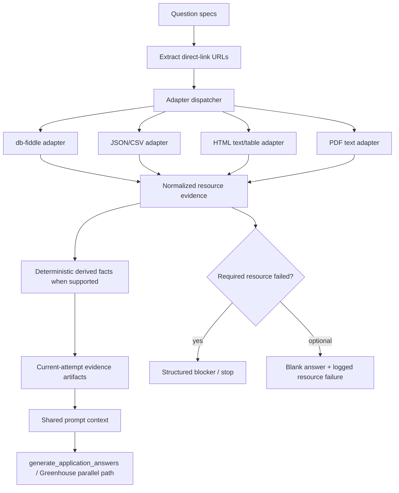

# feat: add linked-resource submit answers

## Overview

Add a shared, controlled linked-resource fetch path for submit-time generated application answers. The runtime should prefetch directly linked public resources, extract deterministic facts when possible, save current-attempt evidence, and then feed the derived context into the existing shared answer-generation path without expanding submit mode into open-ended web research. (see origin: `docs/brainstorms/2026-03-28-linked-resource-submit-answer-requirements.md`)

## Problem Frame

Ramp's db-fiddle screening question exposed a broader product gap: submit-mode generated answers can see a directly linked public exercise, but the current runtime still answers as if it has no access to that resource. Today the only shared linked-resource seam is `build_linked_resource_context()` in `scripts/application_submit_common.py`, which fetches a short text excerpt from up to two URLs, does not persist evidence, does not distinguish required vs optional failures, and cannot handle structured exercises like db-fiddle. At the same time, submit-mode provider settings intentionally disable web search and file tools, so widening provider permissions is not the right first move. This feature should fix the capability at the shared orchestration layer instead. (see origin: `docs/brainstorms/2026-03-28-linked-resource-submit-answer-requirements.md`)

## Requirements Trace

- R1. Add a controlled shared fetch path for directly linked public read-only resources.
- R2. Support HTML pages, HTML tables, PDFs, CSV/JSON files, and db-fiddle-style structured exercises.
- R3. Keep scope single-hop and direct-link only.
- R4. Fail closed for required linked-resource questions when fetch/parse fails.
- R5. Leave optional linked-resource answers blank but log exact fetch/parse failures.
- R6. Save current-attempt evidence including source URL, fetched snapshot/extracted payload, and derived facts.
- R7. Keep generated answers grounded in linked-resource evidence and existing candidate/source materials.
- R8. Apply through the shared submit-time answer path across boards, not as a Ramp-only fix.
- R9. Surface linked-resource-backed answer evidence in current review artifacts.
- R10. Preserve existing direct-answer behavior for questions with no linked resources.
- R11. Prefer deterministic extraction over model inference when the format supports it.
- R12. Reuse matching linked-resource extraction artifacts across retries/reruns only with an explicit auditable cache boundary.

## Scope Boundaries

- No open-ended web research or provider-side browsing expansion in submit mode.
- No login-required resources, authenticated dashboards, CAPTCHAs, or multi-hop browsing.
- No change to the general draft-vs-submit product rule.
- No broad prompt redesign outside linked-resource capability and provenance.
- No board-specific one-off that bypasses the shared submit-time answer path unless an adapter truly must remain board-local.

## Context & Research

### Relevant Code and Patterns

- `scripts/application_submit_common.py`
  - `build_linked_resource_context()` is the current shared seam, but it only fetches short excerpts and does not persist proof or distinguish required-vs-optional failures.
  - `generate_application_answers()` is the primary shared orchestration path used by most board submitters.
  - `_run_answer_generation_provider()` already handles provider retries and raw-artifact logging for submit-time answers.
- `scripts/autofill_greenhouse.py`
  - `_generate_application_answers()` is the Greenhouse parallel answer-generation path that must stay in parity with the shared path.
  - Greenhouse already preserves current-attempt proof artifacts aggressively, so it is a good consumer for linked-resource evidence.
- `scripts/llm_provider.py`
  - `prompt_mode_settings("submit")` currently disables `search_enabled` and `file_tools_enabled`.
  - Existing tests explicitly lock the “submit mode has no provider-side search/file-tools” behavior, which is a useful guardrail.
- `scripts/submit_review_common.py`, `scripts/job_web.py`, `scripts/draft_manager.py`, `scripts/build_draft_summary.py`
  - These are the existing current-attempt review and proof-surface seams that can surface new linked-resource artifacts without inventing a new review product.
- `scripts/fetch_dbfiddle.py` and `scripts/analyze_dbfiddle.py`
  - These are useful prototypes and prior art for a db-fiddle adapter, but they are not production-integrated or generalized today.

### Institutional Learnings

- `docs/solutions/workflow-issues/explicit-answer-regeneration-requires-durable-fresh-proof-2026-03-26.md`
  - Current-attempt artifact boundaries and cache explicitness matter. Linked-resource evidence should follow the same contract rather than living in process memory or ambiguous shared temp files.
- `docs/solutions/workflow-issues/stopped-job-audits-must-be-repo-local-and-artifact-backed-2026-03-27.md`
  - Dominant stopped-job fixes need durable disk evidence, not just logs or inferred explanations.

### External References

- None used. This plan is grounded in repo-local patterns and the existing requirements doc.

## Key Technical Decisions

- **Prefetch outside the provider, not inside submit-mode provider tools.**
  - Keep `prompt_mode_settings("submit")` restrictive. Fetch and normalize linked resources in repo-controlled Python before prompt construction.
  - Rationale: this preserves the direct-link-only boundary, works consistently across OpenAI/Claude/Codex/Gemini, and keeps evidence capture auditable.

- **Use a new shared linked-resource module rather than growing `application_submit_common.py` inline.**
  - Rationale: the feature spans extraction, cache keys, provenance, failure classification, and adapter dispatch. A dedicated module keeps the shared answer pipeline legible.

- **Use adapter-based extraction with db-fiddle first, then generic formats.**
  - First delivery order: db-fiddle, JSON/CSV, generic HTML text+tables, then PDF text.
  - Rationale: db-fiddle is the concrete live user problem, while JSON/CSV and generic HTML are low-cost extensions that fit the same contract.

- **Persist both resource evidence and derived facts under the active submit attempt.**
  - Rationale: the answer itself is not enough for review/debugging. The artifact set should explain what was fetched and what facts were used.

- **Represent required linked-resource failures as structured blockers before LLM answer generation.**
  - Rationale: required-resource failures are product blockers, not model failures. They should stop the draft before the model invents a fallback.

- **Keep optional linked-resource failures non-blocking but visible.**
  - Rationale: optional questions should not stall the whole draft, but the review surface still needs to show why they were blank.

## Open Questions

### Resolved During Planning

- **Where should the shared contract live?**
  - Resolution: a new shared module under `scripts/` (for example `linked_resource_context.py` plus adapter helpers), invoked from both `generate_application_answers()` and Greenhouse’s parallel answer path.

- **Should submit-mode provider permissions expand?**
  - Resolution: no. Keep submit-mode provider tool/search restrictions in place and prefetch resources in repo-controlled code before prompting.

- **What should be the first adapter order?**
  - Resolution: db-fiddle first, then JSON/CSV, then generic HTML text/tables, then PDF text.

### Deferred to Implementation

- Exact adapter file split (single module vs `linked_resource_adapters/` package) can be finalized during implementation once the test seams are clearer.
- The exact evidence JSON shape can evolve during implementation as long as it preserves URL, adapter type, fetched payload reference, and derived facts.
- The db-fiddle adapter may need to choose between parsing visible result tables, extracting SQL/editor content, or executing a constrained deterministic analysis path depending on what the live page exposes.

## High-Level Technical Design

> *This illustrates the intended approach and is directional guidance for review, not implementation specification. The implementing agent should treat it as context, not code to reproduce.*

## Implementation Units

- [x] **Unit 1: Shared linked-resource contract and artifact schema**

**Goal:** Define the shared orchestration seam that extracts direct-link resources, classifies failures, and writes current-attempt evidence/provenance.

**Requirements:** R1, R3, R4, R5, R6, R8, R12

**Dependencies:** None

**Files:**
- Create: `scripts/linked_resource_context.py`
- Modify: `scripts/output_layout.py`
- Test: `tests/test_linked_resource_context.py`

**Approach:**
- Introduce a shared resource-request/result model with:
  - extracted URL(s) and owning question label/field name
  - adapter type
  - required/optional classification
  - fetched snapshot/extracted payload refs
  - derived facts
  - structured failure reason when fetch/parse fails
- Write evidence into the active/current submit attempt under a dedicated artifact boundary, e.g.:
  - `submit/linked_resource_context.json`
  - `submit/linked_resource_failures.json`
  - `submit/linked_resource_evidence/<resource-key>.*`
- Add cache matching rules based on URL + adapter + content fingerprint so retries can reuse evidence explicitly without hiding stale data.

**Execution note:** Start with failing helper tests for required-vs-optional failure handling and current-attempt artifact writing.

**Patterns to follow:**
- `scripts/greenhouse_failure_artifacts.py`
- `scripts/submit_review_common.py`
- `scripts/output_layout.py`
- `docs/solutions/workflow-issues/explicit-answer-regeneration-requires-durable-fresh-proof-2026-03-26.md`

**Test scenarios:**
- Required linked resource fetch failure yields a blocking structured result.
- Optional linked resource fetch failure yields a logged non-blocking result.
- Matching cached evidence is reused only when URL/adapter/content fingerprint all match.
- New fetch writes evidence into the active submit attempt, not a stale prior attempt.

**Verification:**
- Implementers can load one helper and get both prompt-ready context and a durable evidence/failure artifact set for the current submit attempt.

- [x] **Unit 2: Add controlled resource adapters with db-fiddle first**

**Goal:** Support the first useful set of directly linked resource types with deterministic extraction where possible.

**Requirements:** R2, R3, R6, R7, R11

**Dependencies:** Unit 1

**Files:**
- Create: `scripts/linked_resource_adapters/db_fiddle.py`
- Create: `scripts/linked_resource_adapters/generic_fetch.py`
- Modify: `scripts/fetch_dbfiddle.py`
- Modify: `scripts/analyze_dbfiddle.py`
- Test: `tests/test_linked_resource_context.py`
- Test: `tests/test_db_fiddle_adapter.py`

**Approach:**
- Promote the db-fiddle prototypes into importable helpers rather than stand-alone scripts only.
- Support:
  - db-fiddle extraction of editor content and/or visible results
  - JSON/CSV parsing into normalized tables/rows
  - generic HTML text + table extraction
  - PDF text extraction
- For db-fiddle and similarly structured inputs, compute deterministic derived facts when the extracted resource provides enough structure (e.g. row counts, aggregates, obvious tabular answers).
- Keep the adapter contract read-only and single-hop.

**Technical design:** *(directional guidance)*
- Generic adapters return normalized evidence objects.
- The db-fiddle adapter may emit both raw extracted content and a structured “facts” block when deterministic analysis succeeds.

**Patterns to follow:**
- `scripts/fetch_dbfiddle.py`
- `scripts/analyze_dbfiddle.py`
- `scripts/scrape_job.py` (fetch/error handling patterns)

**Test scenarios:**
- db-fiddle URL yields extracted evidence instead of a generic “cannot access external links” fallback.
- JSON/CSV links produce structured derived payloads.
- Unsupported content type is rejected cleanly with a structured failure.
- Adapter failures preserve URL + failure reason for required vs optional handling.

**Verification:**
- At least one db-fiddle resource and one generic resource type can be fetched into normalized evidence without widening provider-side permissions.

- [x] **Unit 3: Integrate linked-resource context into shared and Greenhouse answer generation**

**Goal:** Make linked-resource-backed answer generation part of the shared submit-time path and keep Greenhouse in parity.

**Requirements:** R1, R4, R5, R7, R8, R10, R12

**Dependencies:** Unit 1, Unit 2

**Files:**
- Modify: `scripts/application_submit_common.py`
- Modify: `scripts/autofill_greenhouse.py`
- Modify: `scripts/llm_provider.py` *(only if needed to preserve/clarify submit-mode invariants; not to widen provider permissions)*
- Test: `tests/test_submit_application.py`
- Test: `tests/test_greenhouse_autofill.py`
- Test: `tests/test_llm_provider.py`

**Approach:**
- Replace `build_linked_resource_context()` with the new shared linked-resource fetch/evidence seam.
- For required linked-resource failures, raise a structured blocker before the provider is called.
- For optional failures, feed explicit “resource unavailable” metadata into the prompt context and omit the answer field unless another deterministic/source-backed answer exists.
- Keep `submit` prompt mode provider-side search/file-tools disabled unless implementation reveals an unavoidable hole; the plan’s preferred design is prefetch, not provider browsing.
- Ensure Greenhouse’s parallel `_generate_application_answers()` uses the same resource contract and failure behavior as `generate_application_answers()`.

**Execution note:** Characterization-first. Preserve the current “submit mode provider tools are restricted” contract unless an explicit implementation-time decision changes it with new tests.

**Patterns to follow:**
- `scripts/application_submit_common.py::generate_application_answers()`
- `scripts/autofill_greenhouse.py::_generate_application_answers()`
- `tests/test_submit_application.py`
- `tests/test_greenhouse_autofill.py`
- `tests/test_llm_provider.py::test_provider_command_for_mode_openai_submit_no_file_tools`

**Test scenarios:**
- Required linked-resource question blocks the draft when fetch fails.
- Optional linked-resource question remains blank but records the failure.
- OpenAI submit-mode answer generation uses linked-resource context without needing `--search` / `--file-tools`.
- Greenhouse and shared submit paths behave the same for linked-resource questions.
- Existing non-linked generated-answer questions remain unchanged.

**Verification:**
- The shared and Greenhouse submit-time answer generators can answer linked-resource questions from saved evidence while preserving current provider-mode boundaries.

- [x] **Unit 4: Surface linked-resource provenance in current review artifacts**

**Goal:** Make review surfaces and artifacts show which answers used linked resources and where the proof lives.

**Requirements:** R6, R8, R9, R10

**Dependencies:** Unit 1, Unit 3

**Files:**
- Modify: `scripts/build_draft_summary.py`
- Modify: `scripts/draft_manager.py`
- Modify: `scripts/submit_review_common.py`
- Modify: `scripts/job_web.py`
- Modify: `scripts/static/app.js`
- Test: `tests/test_draft_manager.py`
- Test: `tests/test_job_web.py`
- Test: `tests/test_submit_application.py`

**Approach:**
- Extend current-attempt proof resolution so linked-resource evidence files can be surfaced alongside existing report/screenshot artifacts.
- Add answer-level provenance markers in review summaries, for example:
  - “Used linked resource”
  - “Evidence: linked_resource_context.json”
  - “Failure: could not fetch linked resource”
- Keep the UI additive and compact; reuse the current proof/pending-review surfaces instead of inventing a separate linked-resource dashboard.

**Patterns to follow:**
- `scripts/submit_review_common.py`
- `scripts/job_web.py::_serialize_proof_artifacts`
- `scripts/draft_manager.py::generate_draft_summary`

**Test scenarios:**
- Draft summary shows linked-resource provenance for a successfully answered linked-resource question.
- A required linked-resource blocker appears in the same review flow as other draft blockers.
- Optional linked-resource failures are visible without marking the draft blocked.

**Verification:**
- Reviewers can see both the linked-resource answer provenance and any linked-resource fetch failure from the current submit attempt without opening raw logs.

- [x] **Unit 5: Roll the feature across submit-time board consumers and documentation**

**Goal:** Ensure the shared capability is actually inherited across boards and documented consistently.

**Requirements:** R8, R10, R12

**Dependencies:** Unit 3, Unit 4

**Files:**
- Modify: `scripts/autofill_ashby.py`
- Modify: `scripts/autofill_linkedin.py`
- Modify: `scripts/autofill_lever.py`
- Modify: `scripts/autofill_workday.py`
- Modify: `docs/autofill-patterns.md`
- Modify: `docs/provider-setup.md` *(only if provider expectations need clarifying)*
- Test: `tests/test_ashby_autofill.py`
- Test: `tests/test_lever_autofill.py`
- Test: `tests/test_autofill_linkedin.py`
- Test: `tests/test_autofill_workday.py`

**Approach:**
- Audit the submit-time board consumers that call `generate_application_answers()` and confirm they inherit the shared linked-resource contract without board-local reimplementation.
- Add characterization coverage on at least one non-Greenhouse board to ensure the shared path really propagates.
- Update documentation so the linked-resource contract and proof expectations are discoverable in-repo.

**Patterns to follow:**
- Shared answer-generation integration patterns already used by Ashby/Lever/LinkedIn/Workday
- `docs/autofill-patterns.md`

**Test scenarios:**
- A shared submit-time board besides Greenhouse can consume linked-resource-backed answers through the common path.
- Existing direct-answer deterministic questions are unaffected.
- Cache reuse across retries remains explicit and current-attempt-scoped.

**Verification:**
- The linked-resource capability is demonstrably shared, not a hidden Greenhouse-only or Ramp-only behavior.

## System-Wide Impact

- **Interaction graph:** `generate_application_answers()` feeds many board submitters; Greenhouse has a parallel path; review surfaces resolve current-attempt artifacts from shared submit boundaries; provider command builders still shape tool/search access for submit-mode prompts.
- **Error propagation:** Required linked-resource fetch failures should short-circuit into structured draft blockers before provider invocation. Optional failures should flow into review artifacts and blank answers without pretending the question was solved.
- **State lifecycle risks:** Linked-resource evidence must stay scoped to the active/current submit attempt. Reuse across retries must be keyed explicitly so stale external snapshots do not masquerade as current proof.
- **API surface parity:** Greenhouse’s parallel answer-generation path must preserve parity with the shared `application_submit_common.py` path. Boards that call the shared generator should inherit the behavior without additional per-board prompt logic.
- **Integration coverage:** Unit tests alone will not prove the live Ramp/db-fiddle path. Implementation should include at least one regenerated real output directory showing a linked-resource-backed answer plus its saved evidence artifacts.

## Risks & Dependencies

- Public resource formats vary widely. Adapter boundaries must stay disciplined or the “broad but controlled” scope will leak into open-ended browsing.
- db-fiddle may require browser automation or DOM-specific extraction that is slower or more brittle than plain HTTP fetches.
- Deterministic derivation is valuable but can overfit if it becomes “answer any external exercise.” The first version should stay bounded to supported resource adapters and explicit derived facts.
- Review-surface expansion should reuse existing artifact contracts rather than fragmenting into one-off UI-only fields.

## Documentation / Operational Notes

- Document the linked-resource submit-answer contract in `docs/autofill-patterns.md`.
- If the implementation preserves submit-mode provider restrictions, update `docs/provider-setup.md` or adjacent provider docs only if users would otherwise expect OpenAI/Codex submit-mode web access automatically.
- If linked-resource evidence is cached across attempts, document the invalidation boundary so future stopped-job audits can trust the artifacts.

## Sources & References

- **Origin document:** [docs/brainstorms/2026-03-28-linked-resource-submit-answer-requirements.md](../brainstorms/2026-03-28-linked-resource-submit-answer-requirements.md)
- Related learning: [docs/solutions/workflow-issues/explicit-answer-regeneration-requires-durable-fresh-proof-2026-03-26.md](../solutions/workflow-issues/explicit-answer-regeneration-requires-durable-fresh-proof-2026-03-26.md)
- Related code: [application_submit_common.py](../../scripts/application_submit_common.py)
- Related code: [autofill_greenhouse.py](../../scripts/autofill_greenhouse.py)
- Related code: [fetch_dbfiddle.py](../../scripts/fetch_dbfiddle.py)
- Related code: [analyze_dbfiddle.py](../../scripts/analyze_dbfiddle.py)
- Related PRs: #46, #47, #48
